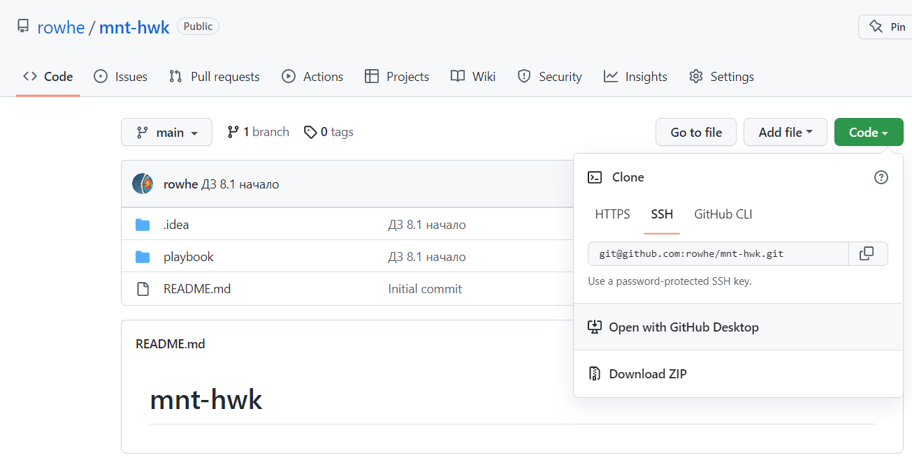
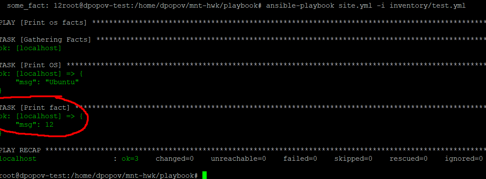
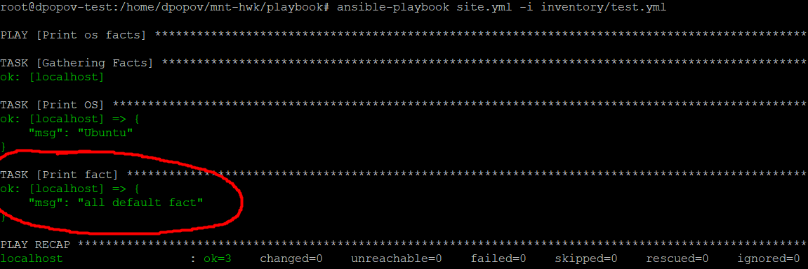
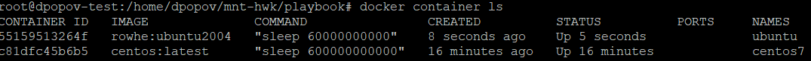
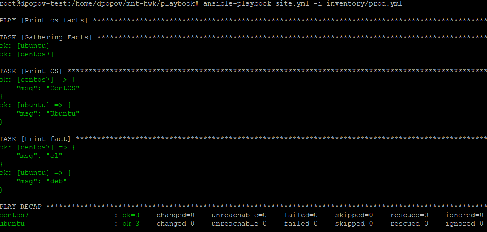
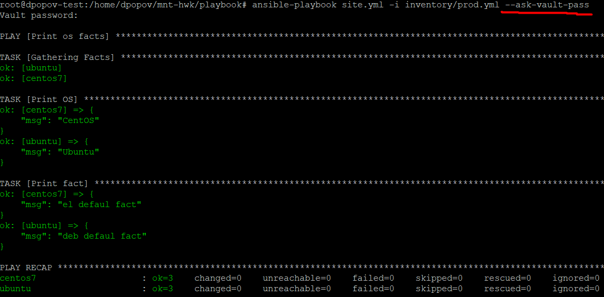
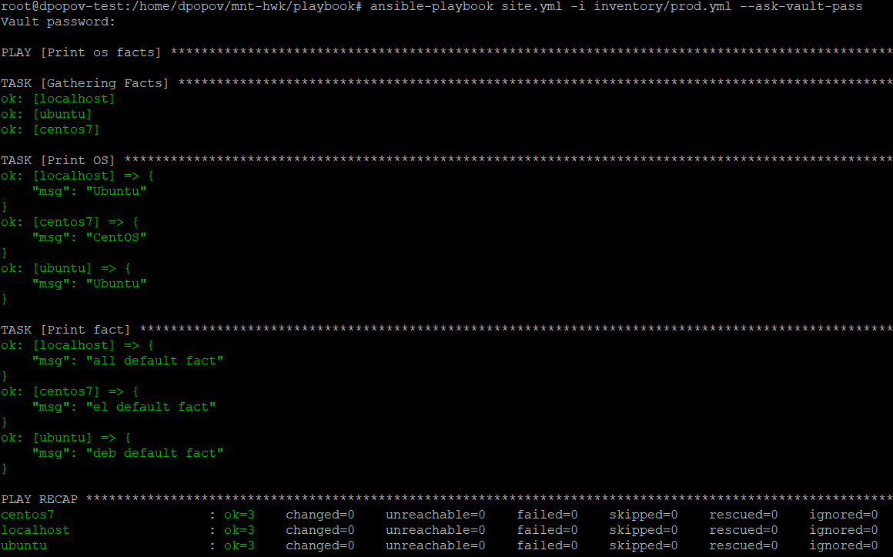
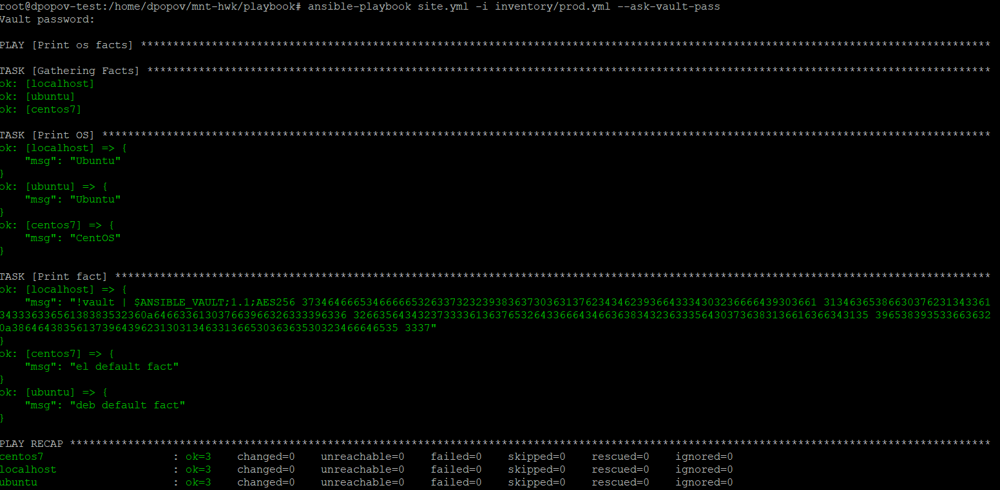

# Домашнее задание к занятию "08.01 Введение в Ansible"

## Подготовка к выполнению
1. Установите ansible версии 2.10 или выше.
    * Проверяем установленную версию Ansible
   ```shell
    dpopov@dpopov-test:~$ ansible --version
    ansible 2.10.8
      config file = None
      configured module search path = ['/home/dpopov/.ansible/plugins/modules', '/usr/share/ansible/plugins/modules']
      ansible python module location = /usr/lib/python3/dist-packages/ansible
      executable location = /usr/bin/ansible
      python version = 3.9.7 (default, Sep 10 2021, 14:59:43) [GCC 11.2.0]
    
    ```
2. Создайте свой собственный публичный репозиторий на github с произвольным именем.
3. Скачайте [playbook](./playbook/) из репозитория с домашним заданием и перенесите его в свой репозиторий.
   * Создаем новый репозиторий на GitHub и переносим в него директорию `playbook`
 

## Основная часть
1. Попробуйте запустить playbook на окружении из `test.yml`, зафиксируйте какое значение имеет факт `some_fact` для указанного хоста при выполнении playbook'a.
   * Выполним плейбук `site.yml` на окружении из 'inventory/test.yml':
   
   * Мы получили значение `12` для `some_fact`
2. Найдите файл с переменными (group_vars) в котором задаётся найденное в первом пункте значение и поменяйте его на 'all default fact'.
   * Заменяем значение `12` на `all defaul facts` в файле `group_vars/all/example.yml` и проверяем результат запуска команды:
   
3. Воспользуйтесь подготовленным (используется `docker`) или создайте собственное окружение для проведения дальнейших испытаний.
   * Запускаем контейнеры `ubuntu` и `centos7`
   
4. Проведите запуск playbook на окружении из `prod.yml`. Зафиксируйте полученные значения `some_fact` для каждого из `managed host`.
   * Запускаем плэйбук `site.yml` на окружение `inventory/prod.yml`
   
   * Для хоста `centos7` получаем значение `el` и для хоста `ubuntu` получаем значение `deb`
5. Добавьте факты в `group_vars` каждой из групп хостов так, чтобы для `some_fact` получились следующие значения: для `deb` - 'deb default fact', для `el` - 'el default fact'.
6. Повторите запуск playbook на окружении `prod.yml`. Убедитесь, что выдаются корректные значения для всех хостов.
   * Добавляем факты в `group_vars` и проверяем правильность
   
7. При помощи `ansible-vault` зашифруйте факты в `group_vars/deb` и `group_vars/el` с паролем `netology`.
   * Шифруем 'group_vars' при помощи `ansible-vault` паролем 'netology':
   
8. Запустите playbook на окружении `prod.yml`. При запуске `ansible` должен запросить у вас пароль. Убедитесь в работоспособности.
   * Запускаем ансибл с ключем `--ask-vault-pass` для расшифровки конфигурации
    
9. Посмотрите при помощи `ansible-doc` список плагинов для подключения. Выберите подходящий для работы на `control node`.
   * Командой ` ansible-doc -t connection -l` можно получить список плагинов для подключения. Из подходящих для работы на 'control node' можно называть `local', 'ssh', 'paramiko_ssh'
10. В `prod.yml` добавьте новую группу хостов с именем  `local`, в ней разместите localhost с необходимым типом подключения. 
    * Добавляем группу хостов 'local'
    ```shell
      ---
        el:
          hosts:
            centos7:
              ansible_connection: docker
        deb:
          hosts:
            ubuntu:
              ansible_connection: docker
        local:
          hosts:
            localhost:
              ansible_connection: ssh
      
      ```
11. Запустите playbook на окружении `prod.yml`. При запуске `ansible` должен запросить у вас пароль. Убедитесь что факты `some_fact` для каждого из хостов определены из верных `group_vars`.
    * проверяем, что правильно добавили группу `local`
    
12. Заполните `README.md` ответами на вопросы. Сделайте `git push` в ветку `master`. В ответе отправьте ссылку на ваш открытый репозиторий с изменённым `playbook` и заполненным `README.md`.

## Необязательная часть

1. При помощи `ansible-vault` расшифруйте все зашифрованные файлы с переменными.
   * Расшифровываем данные:
   ```shell
   dpopov@dpopov-test:~/mnt-hwk/playbook$ ansible-vault decrypt group_vars/el/examp.yml
   Vault password:
   Decryption successful
   dpopov@dpopov-test:~/mnt-hwk/playbook$ ansible-vault decrypt group_vars/deb/examp.yml
   Vault password:
   Decryption successful
   ```
   1. Зашифруйте отдельное значение `PaSSw0rd` для переменной `some_fact` паролем `netology`. Добавьте полученное значение в `group_vars/all/exmp.yml`.
      * Шифруем переменную `some_fact` в группе 'all':
   ```shell
       dpopov@dpopov-test:~/mnt-hwk$ ansible-vault encrypt_string
   New Vault password:
   Confirm New Vault password:
   Reading plaintext input from stdin. (ctrl-d to end input, twice if your content does not already have a newline)
   PaSSw0rd
   !vault |
             $ANSIBLE_VAULT;1.1;AES256
             32316663326139356433633533353837633566643633633361653062653136656437616437383135
             3239633762643965366631303136316261656133623433640a643765313430363635336163373263
             30373532333466336364663138653362633236653733363639366235393239386562393664636666
             6662343238376466370a386663363862336237636537323730363564323430346231666363343031
             3135
Encryption successful

   
   ```
2. Запустите `playbook`, убедитесь, что для нужных хостов применился новый `fact`.

3. 
4. Добавьте новую группу хостов `fedora`, самостоятельно придумайте для неё переменную. В качестве образа можно использовать [этот](https://hub.docker.com/r/pycontribs/fedora).
   * Запускаем хост 'fedora' в 'docker'
   ```shell
   root@dpopov-test:/home/dpopov/mnt-hwk/playbook# docker run --rm -d --name fedora fedora:latest sleep 600000000
   ba7c00dee1c9343a69deb26328c3737718d7bdeb61baeb8f5a23bad7d21f3527
   root@dpopov-test:/home/dpopov/mnt-hwk/playbook# docker container ls
   CONTAINER ID   IMAGE              COMMAND                CREATED         STATUS        PORTS     NAMES
   ba7c00dee1c9   fedora:latest      "sleep 600000000"      2 seconds ago   Up 1 second             fedora
   55159513264f   rowhe:ubuntu2004   "sleep 60000000000"    3 hours ago     Up 3 hours              ubuntu
   c81dfc45b6b5   centos:latest      "sleep 600000000000"   3 hours ago     Up 3 hours              centos7
   
   ```
   5. Напишите скрипт на bash: автоматизируйте поднятие необходимых контейнеров, запуск ansible-playbook и остановку контейнеров.
      * [Cкрипт](https://github.com/rowhe/mnt-hwk/blob/e2ba405cc963d75e22199f907f995f627fee7558/playbook/script.sh) для запуска контейнеров, плэйбука ансибл и остановки контейнеров
   ```shell
   #!/usr/bin/bash
   
   echo "**********************************"
   echo "Stopping all unwanted containers"
   echo "**********************************"
   docker container ls|grep Up|awk '{print $11}'|xargs -l docker container stop
   echo "**********************************"
   echo "DONE"
   echo "**********************************"
   echo ----------------------------------
   echo "**********************************"
   echo "Starting containers"
   echo "**********************************"
   echo "Starting centos7 container"
   echo "**********************************"
   docker container run --rm -d --name centos7 centos:7 sleep 60000000
   echo "**********************************"
   echo "Starting ubuntu container"
   echo "**********************************"
   docker container run --rm -d --name ubuntu ubuntu:latest sleep 60000000
   echo "**********************************"
   echo "Starting fedora container"
   echo "**********************************"
   docker container run --rm -d --name fedora fedora:latest sleep 60000000
   echo "**********************************"
   echo "Starting Ansible playbook"
   echo "**********************************"
   ansible-playbook site.yml -i inventory/prod.yml --ask-vault-pass
   echo "**********************************"
   echo "Stopping all running containers"
   echo "**********************************"
   docker container ls|grep Up|awk '{print $11}'|xargs -l docker container stop
   echo "**********************************"
   echo "All DONE"
   echo "**********************************"
   ```
6. Все изменения должны быть зафиксированы и отправлены в вашей личный репозиторий.

---

### Как оформить ДЗ?

Выполненное домашнее задание пришлите ссылкой на .md-файл в вашем репозитории.

---
