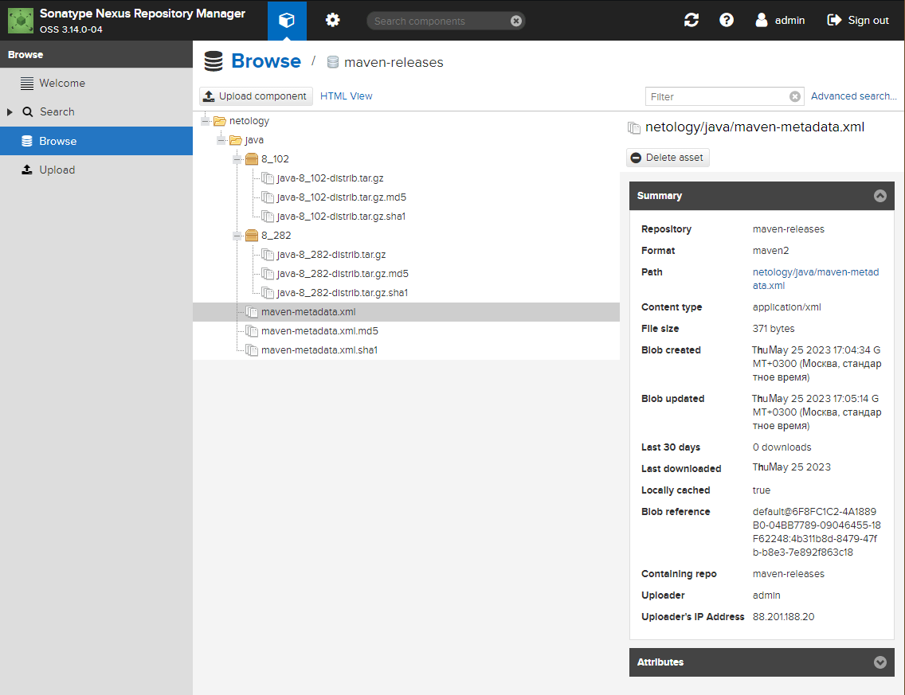

# Домашнее задание по лекции "9.3 Процессы CI\CD"

## Подготовка к выполнению

> 1. Создаём 2 VM в yandex cloud со следующими параметрами: 2CPU 4RAM Centos7(остальное по минимальным требованиям)
> 2. Прописываем в [inventory](./infrastructure/inventory/cicd/hosts.yml) [playbook'a](./infrastructure/site.yml) созданные хосты
> 3. Добавляем в [files](./infrastructure/files/) файл со своим публичным ключом (id_rsa.pub). Если ключ называется иначе - найдите таску в плейбуке, которая использует id_rsa.pub имя и исправьте на своё
> 4. Запускаем playbook, ожидаем успешного завершения
> 5. Проверяем готовность Sonarqube через [браузер](http://localhost:9000)
> 6. Заходим под admin\admin, меняем пароль на свой
> 7. Проверяем готовность Nexus через [бразуер](http://localhost:8081)
> 8. Подключаемся под admin\admin123, меняем пароль, сохраняем анонимный доступ

Облачные машины созданы при помощи **terraform** со следующим [конфигурационным файлом](infrastructure/main.tf).

Усечённый вывод **terraform**:

```console
...
Changes to Outputs:
  + nexus_ip = (known after apply)
  + sonar_ip = (known after apply)
yandex_vpc_network.my-net: Creating...
yandex_compute_image.centos-7: Creating...
yandex_vpc_network.my-net: Creation complete after 1s [id=enpqhvvlh3fcaeiok3ve]
yandex_vpc_subnet.my-subnet: Creating...
yandex_vpc_subnet.my-subnet: Creation complete after 1s [id=e9bthsk1hvrcni3kn3k9]
yandex_compute_image.centos-7: Creation complete after 7s [id=fd80n8bdihrnuj2clid4]
yandex_compute_instance.vm["nexus"]: Creating...
yandex_compute_instance.vm["sonar"]: Creating...
yandex_compute_instance.vm["sonar"]: Still creating... [10s elapsed]
yandex_compute_instance.vm["nexus"]: Still creating... [10s elapsed]
yandex_compute_instance.vm["nexus"]: Still creating... [20s elapsed]
yandex_compute_instance.vm["sonar"]: Still creating... [20s elapsed]
yandex_compute_instance.vm["sonar"]: Still creating... [30s elapsed]
yandex_compute_instance.vm["nexus"]: Still creating... [30s elapsed]
yandex_compute_instance.vm["nexus"]: Still creating... [40s elapsed]
yandex_compute_instance.vm["sonar"]: Still creating... [40s elapsed]
yandex_compute_instance.vm["nexus"]: Creation complete after 42s [id=fhm2681f29hakbal2fbi]
yandex_compute_instance.vm["sonar"]: Creation complete after 42s [id=fhmu72j5klsu30sqj9mp]

Apply complete! Resources: 5 added, 0 changed, 0 destroyed.

Outputs:

nexus_ip = "51.250.17.146"
sonar_ip = "51.250.3.1"
┌──(kali㉿kali)-[~/09-ci-03-cicd/infrastructure]
└─$ 
```

Вместо копирования `id_rsa.pub` внесены изменения в соответствующую **task**:

```yaml
    - name: "Set up ssh key to access for managed node"
      authorized_key:
        user: "{{ sonarqube_db_user }}"
        state: present
        key: "{{ lookup('file', '~/.ssh/id_ed25519.pub') }}"
```

Проверка функционирования окружения (часть вывода **Ansible** пропущена):

```console
...
PLAY RECAP *************************************************************************************************************
nexus-01                   : ok=17   changed=15   unreachable=0    failed=0    skipped=2    rescued=0    ignored=0
sonar-01                   : ok=35   changed=27   unreachable=0    failed=0    skipped=0    rescued=0    ignored=0

┌──(kali㉿kali)-[~/09-ci-03-cicd/infrastructure]
└─$ ping 51.250.3.1 -p 9000
PATTERN: 0x9000
PING 51.250.3.1 (51.250.3.1) 56(84) bytes of data.
64 bytes from 51.250.3.1: icmp_seq=1 ttl=50 time=17.3 ms
64 bytes from 51.250.3.1: icmp_seq=2 ttl=50 time=16.3 ms
64 bytes from 51.250.3.1: icmp_seq=3 ttl=50 time=16.4 ms
64 bytes from 51.250.3.1: icmp_seq=4 ttl=50 time=16.2 ms
64 bytes from 51.250.3.1: icmp_seq=5 ttl=50 time=16.1 ms
^C
--- 51.250.3.1 ping statistics ---
5 packets transmitted, 5 received, 0% packet loss, time 4043ms
rtt min/avg/max/mdev = 16.085/16.462/17.306/0.435 ms
┌──(kali㉿kali)-[~/09-ci-03-cicd/infrastructure]
└─$ ping 51.250.17.146 -p 8081
PATTERN: 0x8081
PING 51.250.17.146 (51.250.17.146) 56(84) bytes of data.
64 bytes from 51.250.17.146: icmp_seq=1 ttl=51 time=14.9 ms
64 bytes from 51.250.17.146: icmp_seq=2 ttl=51 time=14.8 ms
64 bytes from 51.250.17.146: icmp_seq=3 ttl=51 time=14.7 ms
64 bytes from 51.250.17.146: icmp_seq=4 ttl=51 time=14.3 ms
64 bytes from 51.250.17.146: icmp_seq=5 ttl=51 time=14.7 ms
^C
--- 51.250.17.146 ping statistics ---
5 packets transmitted, 5 received, 0% packet loss, time 4029ms
rtt min/avg/max/mdev = 14.334/14.684/14.915/0.191 ms
┌──(kali㉿kali)-[~/09-ci-03-cicd/infrastructure]
└─$
```

## Знакомоство с SonarQube

### Основная часть

> 1. Создаём новый проект, название произвольное
> 2. Скачиваем пакет sonar-scanner, который нам предлагает скачать сам sonarqube
> 3. Делаем так, чтобы binary был доступен через вызов в shell (или меняем переменную PATH или любой другой удобный вам способ)
> 4. Проверяем `sonar-scanner --version`
> 5. Запускаем анализатор против кода из директории [example](./example) с дополнительным ключом `-Dsonar.coverage.exclusions=fail.py`
> 6. Смотрим результат в интерфейсе
> 7. Исправляем ошибки, которые он выявил(включая warnings)
> 8. Запускаем анализатор повторно - проверяем, что QG пройдены успешно
> 9. Делаем скриншот успешного прохождения анализа, прикладываем к решению ДЗ

Проверка функционирования **sonar-scanner**:

```console
┌──(kali㉿kali)-[~/09-ci-03-cicd]
└─$  sonar-scanner --version
INFO: Scanner configuration file: /home/sa/.local/conf/sonar-scanner.properties
INFO: Project root configuration file: NONE
INFO: SonarScanner 4.7.0.2747
INFO: Java 11.0.14.1 Eclipse Adoptium (64-bit)
INFO: Linux 5.18.0-3-amd64 amd64
┌──(kali㉿kali)-[~/09-ci-03-cicd]
└─$ 
```

Готовая команда запуска анализатора кода:

```console
sonar-scanner -Dsonar.projectKey=netology -Dsonar.sources=. -Dsonar.host.url=http://51.250.3.1:9000 -Dsonar.login=543945fc60861f017e8d81c8d6557c971dd4fa9b -Dsonar.coverage.exclusions=fail.py
```

Пример запуска анализатора кода:

```console
┌──(kali㉿kali)-[~/09-ci-03-cicd/example]
└─$ sonar-scanner -Dsonar.projectKey=netology -Dsonar.sources=. -Dsonar.host.url=http://51.250.3.1:9000 -Dsonar.login=543945fc60861f017e8d81c8d6557c971dd4fa9b -Dsonar.coverage.exclusions=fail.py
INFO: Scanner configuration file: /home/sa/.local/conf/sonar-scanner.properties
INFO: Project root configuration file: NONE
INFO: SonarScanner 4.7.0.2747
INFO: Java 11.0.14.1 Eclipse Adoptium (64-bit)
INFO: Linux 5.18.0-3-amd64 amd64
INFO: User cache: /home/sa/.sonar/cache
INFO: Scanner configuration file: /home/sa/.local/conf/sonar-scanner.properties
INFO: Project root configuration file: NONE
INFO: Analyzing on SonarQube server 9.1.0
INFO: Default locale: "ru_RU", source code encoding: "UTF-8" (analysis is platform dependent)
INFO: Load global settings
INFO: Load global settings (done) | time=119ms
INFO: Server id: 9CFC3560-AYK7Tf0Hvo_99qKV86b9
INFO: User cache: /home/sa/.sonar/cache
INFO: Load/download plugins
INFO: Load plugins index
INFO: Load plugins index (done) | time=65ms
INFO: Load/download plugins (done) | time=139ms
INFO: Process project properties
INFO: Process project properties (done) | time=5ms
INFO: Execute project builders
INFO: Execute project builders (done) | time=1ms
INFO: Project key: netology
INFO: Base dir: /home/sa/ci-cd/example
INFO: Working dir: /home/sa/ci-cd/example/.scannerwork
INFO: Load project settings for component key: 'netology'
INFO: Load project settings for component key: 'netology' (done) | time=91ms
INFO: Load quality profiles
INFO: Load quality profiles (done) | time=132ms
INFO: Load active rules
INFO: Load active rules (done) | time=3592ms
WARN: SCM provider autodetection failed. Please use "sonar.scm.provider" to define SCM of your project, or disable the SCM Sensor in the project settings.
INFO: Indexing files...
INFO: Project configuration:
INFO:   Excluded sources for coverage: fail.py
INFO: 1 file indexed
INFO: Quality profile for py: Sonar way
INFO: ------------- Run sensors on module netology
INFO: Load metrics repository
INFO: Load metrics repository (done) | time=52ms
INFO: Sensor Python Sensor [python]
WARN: Your code is analyzed as compatible with python 2 and 3 by default. This will prevent the detection of issues specific to python 2 or python 3. You can get a more precise analysis by setting a python version in your configuration via the parameter "sonar.python.version"
INFO: Starting global symbols computation
INFO: 1 source file to be analyzed
INFO: Load project repositories
INFO: Load project repositories (done) | time=35ms
INFO: 1/1 source file has been analyzed
INFO: Starting rules execution
INFO: 1 source file to be analyzed
INFO: 1/1 source file has been analyzed
INFO: Sensor Python Sensor [python] (done) | time=359ms
INFO: Sensor Cobertura Sensor for Python coverage [python]
INFO: Sensor Cobertura Sensor for Python coverage [python] (done) | time=8ms
INFO: Sensor PythonXUnitSensor [python]
INFO: Sensor PythonXUnitSensor [python] (done) | time=0ms
INFO: Sensor CSS Rules [cssfamily]
INFO: No CSS, PHP, HTML or VueJS files are found in the project. CSS analysis is skipped.
INFO: Sensor CSS Rules [cssfamily] (done) | time=0ms
INFO: Sensor JaCoCo XML Report Importer [jacoco]
INFO: 'sonar.coverage.jacoco.xmlReportPaths' is not defined. Using default locations: target/site/jacoco/jacoco.xml,target/site/jacoco-it/jacoco.xml,build/reports/jacoco/test/jacocoTestReport.xml
INFO: No report imported, no coverage information will be imported by JaCoCo XML Report Importer
INFO: Sensor JaCoCo XML Report Importer [jacoco] (done) | time=1ms
INFO: Sensor C# Project Type Information [csharp]
INFO: Sensor C# Project Type Information [csharp] (done) | time=1ms
INFO: Sensor C# Analysis Log [csharp]
INFO: Sensor C# Analysis Log [csharp] (done) | time=9ms
INFO: Sensor C# Properties [csharp]
INFO: Sensor C# Properties [csharp] (done) | time=0ms
INFO: Sensor JavaXmlSensor [java]
INFO: Sensor JavaXmlSensor [java] (done) | time=1ms
INFO: Sensor HTML [web]
INFO: Sensor HTML [web] (done) | time=1ms
INFO: Sensor VB.NET Project Type Information [vbnet]
INFO: Sensor VB.NET Project Type Information [vbnet] (done) | time=0ms
INFO: Sensor VB.NET Analysis Log [vbnet]
INFO: Sensor VB.NET Analysis Log [vbnet] (done) | time=9ms
INFO: Sensor VB.NET Properties [vbnet]
INFO: Sensor VB.NET Properties [vbnet] (done) | time=0ms
INFO: ------------- Run sensors on project
INFO: Sensor Zero Coverage Sensor
INFO: Sensor Zero Coverage Sensor (done) | time=1ms
INFO: SCM Publisher No SCM system was detected. You can use the 'sonar.scm.provider' property to explicitly specify it.
INFO: CPD Executor Calculating CPD for 1 file
INFO: CPD Executor CPD calculation finished (done) | time=8ms
INFO: Analysis report generated in 50ms, dir size=102,7 kB
INFO: Analysis report compressed in 15ms, zip size=13,7 kB
INFO: Analysis report uploaded in 41ms
INFO: ANALYSIS SUCCESSFUL, you can browse http://51.250.3.1:9000/dashboard?id=netology
INFO: Note that you will be able to access the updated dashboard once the server has processed the submitted analysis report
INFO: More about the report processing at http://51.250.3.1:9000/api/ce/task?id=AYK7doDcvo_99qKV8_hF
INFO: Analysis total time: 5.586 s
INFO: ------------------------------------------------------------------------
INFO: EXECUTION SUCCESS
INFO: ------------------------------------------------------------------------
INFO: Total time: 6.544s
INFO: Final Memory: 16M/57M
INFO: ------------------------------------------------------------------------
┌──(kali㉿kali)-[~/09-ci-03-cicd/example]
└─$ 
```


## Знакомство с Nexus

### Основная часть

> 1. В репозиторий `maven-releases` загружаем артефакт с GAV параметрами:
>   1. groupId: netology
>   2. artifactId: java
>   3. version: 8_282
>   4. classifier: distrib
>   5. type: tar.gz
> 2. В него же загружаем такой же артефакт, но с version: 8_102
> 3. Проверяем, что все файлы загрузились успешно
> 4. В ответе присылаем файл `maven-metadata.xml` для этого артефекта



Метаданные артефакта: [maven-metadata.xml](mvn/maven-metadata.xml)

```xml
<?xml version="1.0" encoding="UTF-8"?>
<metadata modelVersion="1.1.0">
  <groupId>netology</groupId>
  <artifactId>java</artifactId>
  <versioning>
    <latest>8_282</latest>
    <release>8_282</release>
    <versions>
      <version>8_102</version>
      <version>8_282</version>
    </versions>
    <lastUpdated>20230525140514</lastUpdated>
  </versioning>
</metadata>
```

### Знакомство с Maven

### Подготовка к выполнению

> 1. Скачиваем дистрибутив с [maven](https://maven.apache.org/download.cgi)
> 2. Разархивируем, делаем так, чтобы binary был доступен через вызов в shell (или меняем переменную PATH или любой другой удобный вам способ)
> 3. Удаляем из `apache-maven-<version>/conf/settings.xml` упоминание о правиле, отвергающем http соединение( раздел mirrors->id: my-repository-http-blocker)
> 4. Проверяем `mvn --version`
> 5. Забираем директорию [mvn](./mvn) с pom

Проверка функционирования **Maven**:

```console
┌──(kali㉿kali)-[~/09-ci-03-cicd]
└─$  mvn --version
Apache Maven 3.8.6 (84538c9988a25aec085021c365c560670ad80f63)
Maven home: /home/sa/.local
Java version: 11.0.16, vendor: Debian, runtime: /usr/lib/jvm/java-11-openjdk-amd64
Default locale: ru_RU, platform encoding: UTF-8
OS name: "linux", version: "5.18.0-3-amd64", arch: "amd64", family: "unix"
┌──(kali㉿kali)-[~/09-ci-03-cicd]
└─$ 
```

### Основная часть

> 1. Меняем в `pom.xml` блок с зависимостями под наш артефакт из первого пункта задания для Nexus (java с версией 8_282)
> 2. Запускаем команду `mvn package` в директории с `pom.xml`, ожидаем успешного окончания
> 3. Проверяем директорию `~/.m2/repository/`, находим наш артефакт
> 4. В ответе присылаем исправленный файл `pom.xml`

Итоговый файл [pom.xml](mvn/pom.xml):

```xml
<project xmlns="http://maven.apache.org/POM/4.0.0" xmlns:xsi="http://www.w3.org/2001/XMLSchema-instance"
  xsi:schemaLocation="http://maven.apache.org/POM/4.0.0 http://maven.apache.org/xsd/maven-4.0.0.xsd">
  <modelVersion>4.0.0</modelVersion>
 
  <groupId>com.netology.app</groupId>
  <artifactId>simple-app</artifactId>
  <version>1.0-SNAPSHOT</version>
   <repositories>
    <repository>
      <id>my-repo</id>
      <name>maven-releases</name>
      <url>http://51.250.17.146:8081/repository/maven-releases/</url>
    </repository>
  </repositories>
  <dependencies>
    <dependency>
      <groupId>netology</groupId>
      <artifactId>java</artifactId>
      <version>8_282</version>
      <classifier>distrib</classifier>
      <type>tar.gz</type>
    </dependency>
  </dependencies>
</project>
```

Загрузка зависимостей (артефакта) и сборка дистрибутива:

```console
┌──(kali㉿kali)-[~/09-ci-03-cicd/mvn]
└─$  mvn package
[INFO] Scanning for projects...
[INFO]
[INFO] --------------------< com.netology.app:simple-app >---------------------
[INFO] Building simple-app 1.0-SNAPSHOT
[INFO] --------------------------------[ jar ]---------------------------------
[WARNING] The POM for netology:java:tar.gz:distrib:8_282 is missing, no dependency information available
[INFO]
[INFO] --- maven-resources-plugin:2.6:resources (default-resources) @ simple-app ---
[WARNING] Using platform encoding (UTF-8 actually) to copy filtered resources, i.e. build is platform dependent!
[INFO] skip non existing resourceDirectory /home/sa/ci-cd/mvn/src/main/resources
[INFO]
[INFO] --- maven-compiler-plugin:3.1:compile (default-compile) @ simple-app ---
[INFO] No sources to compile
[INFO]
[INFO] --- maven-resources-plugin:2.6:testResources (default-testResources) @ simple-app ---
[WARNING] Using platform encoding (UTF-8 actually) to copy filtered resources, i.e. build is platform dependent!
[INFO] skip non existing resourceDirectory /home/sa/ci-cd/mvn/src/test/resources
[INFO]
[INFO] --- maven-compiler-plugin:3.1:testCompile (default-testCompile) @ simple-app ---
[INFO] No sources to compile
[INFO]
[INFO] --- maven-surefire-plugin:2.12.4:test (default-test) @ simple-app ---
[INFO] No tests to run.
[INFO]
[INFO] --- maven-jar-plugin:2.4:jar (default-jar) @ simple-app ---
[WARNING] JAR will be empty - no content was marked for inclusion!
[INFO] Building jar: /home/sa/ci-cd/mvn/target/simple-app-1.0-SNAPSHOT.jar
[INFO] ------------------------------------------------------------------------
[INFO] BUILD SUCCESS
[INFO] ------------------------------------------------------------------------
[INFO] Total time:  0.588 s
[INFO] Finished at: 2023-05-25T19:10:17+04:00
[INFO] ------------------------------------------------------------------------
┌──(kali㉿kali)-[~/09-ci-03-cicd/mvn]
└─$ 
```

Во время сборки **Maven** должен загрузить необходимые зависимости (если их нет) в каталог
`~/.m2/repository/<группа>/<артефакт>/<версия>`, где `<группа>` - группа артефакта зависимости = **netology**, `<артефакт>` - идентификатор артефакта зависимости = **java**, `<версия>` - требуемая версия = **8_282**.
Таким образом должны появиться файлы в каталоге `~/.m2/repository/netology/java/8_282/`.
При сборке в каталоге запуска рядом с `pom.xml` должен появиться каталог `target` с дистрибутивом, имя которого будет начинаться с `<артефакт>-<версия>`, где `<артефакт>` - название артефакта = **simple-app**, `<версия>` - версия = **1.0-SNAPSHOT**.

Проверка загрузки зависимостей и сборки дистрибутива:

```console
┌──(kali㉿kali)-[~/09-ci-03-cicd/mvn]
└─$  ls target/
maven-archiver  simple-app-1.0-SNAPSHOT.jar
┌──(kali㉿kali)-[~/09-ci-03-cicd/mvn]
└─$ ls ~/.m2/repository/
backport-util-concurrent  classworlds  com  commons-cli  commons-lang  commons-logging  junit  log4j  netology  org
┌──(kali㉿kali)-[~/09-ci-03-cicd/mvn]
└─$ ls ~/.m2/repository/netology/
java
┌──(kali㉿kali)-[~/09-ci-03-cicd/mvn]
└─$ ls ~/.m2/repository/netology/java/
8_282
┌──(kali㉿kali)-[~/09-ci-03-cicd/mvn]
└─$ ls ~/.m2/repository/netology/java/8_282/
java-8_282-distrib.tar.gz  java-8_282-distrib.tar.gz.sha1  java-8_282.pom.lastUpdated  _remote.repositories
┌──(kali㉿kali)-[~/09-ci-03-cicd/mvn]
└─$ 
```
