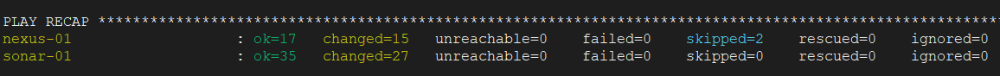
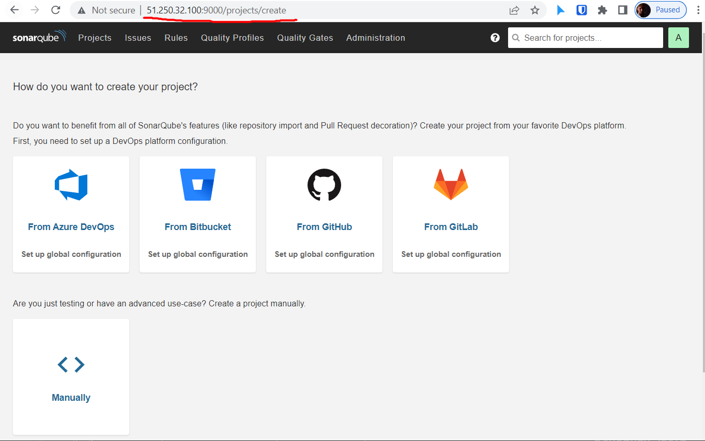
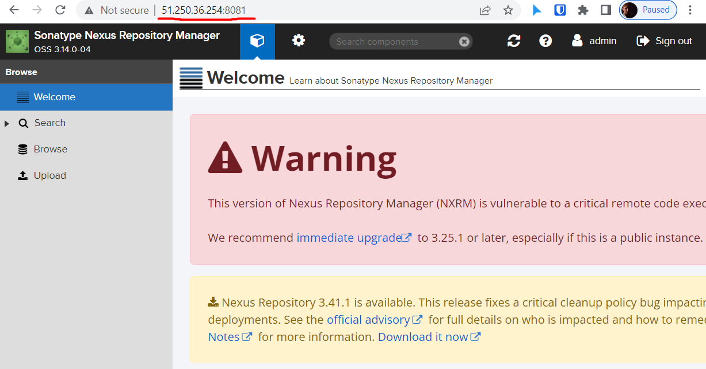
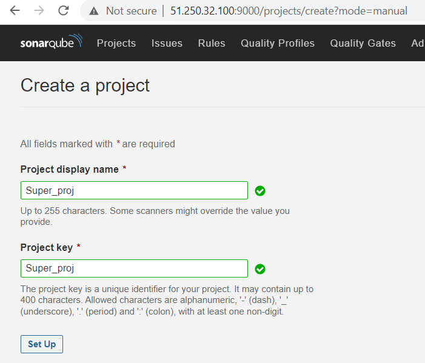
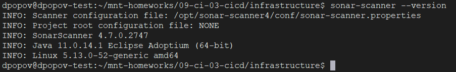
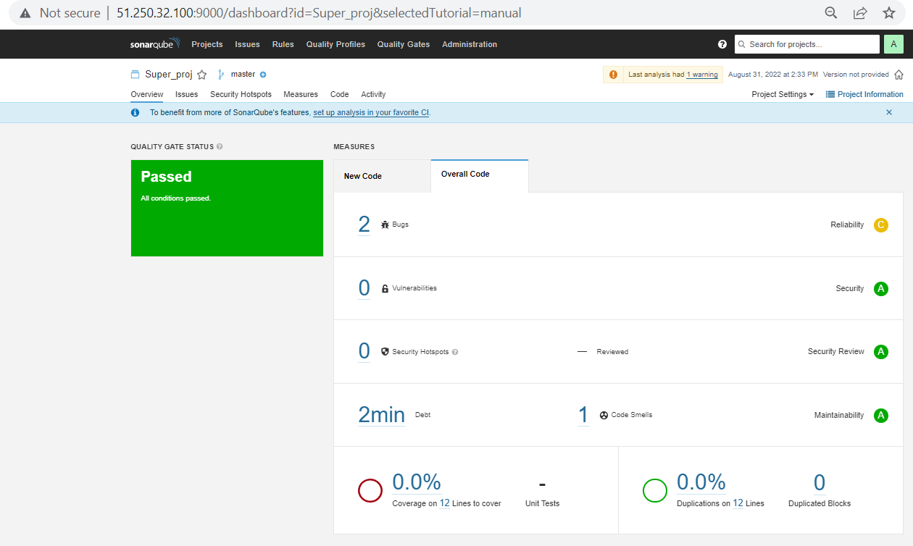
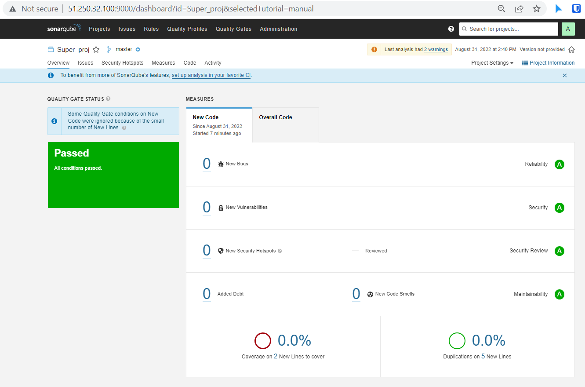
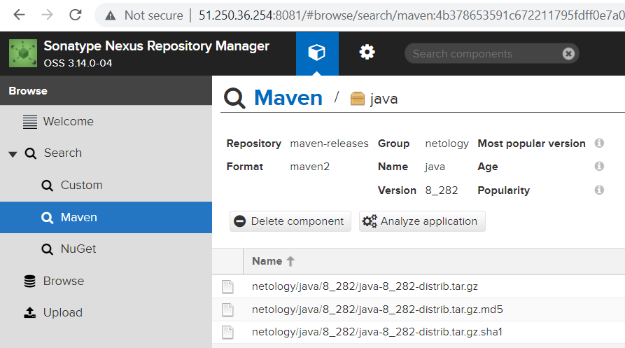
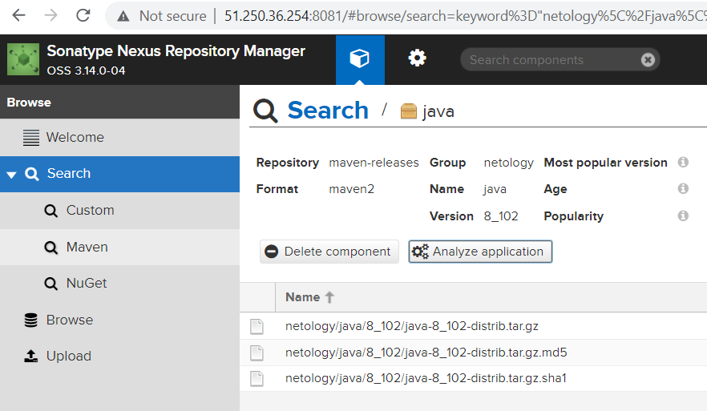
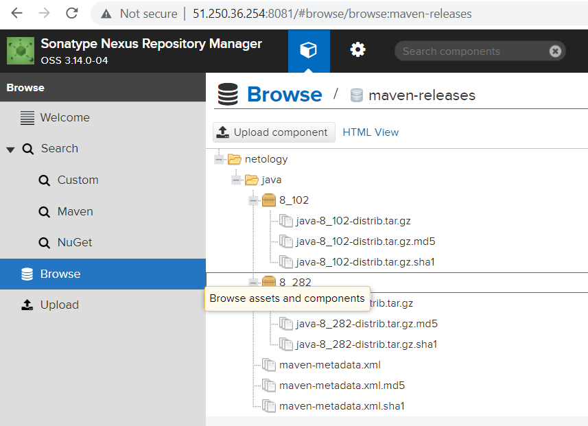

# Домашнее задание к занятию "09.03 CI\CD"

## Подготовка к выполнению

1. Создаём 2 VM в yandex cloud со следующими параметрами: 2CPU 4RAM Centos7(остальное по минимальным требованиям)
2. Прописываем в [inventory](./infrastructure/inventory/cicd/hosts.yml) [playbook'a](./infrastructure/site.yml) созданные хосты
3. Добавляем в [files](./infrastructure/files/) файл со своим публичным ключом (id_rsa.pub). Если ключ называется иначе - найдите таску в плейбуке, которая использует id_rsa.pub имя и исправьте на своё
4. Запускаем playbook, ожидаем успешного завершения
   * Плейбук успешно выполнился:
   
5. Проверяем готовность Sonarqube через [браузер](http://localhost:9000)
6. Заходим под admin\admin, меняем пароль на свой
   * Успешная проверка SonarQube
   
7. Проверяем готовность Nexus через [бразуер](http://localhost:8081)
8. Подключаемся под admin\admin123, меняем пароль, сохраняем анонимный доступ
   * Успешная проверка Nexus
   

## Знакомоство с SonarQube

### Основная часть

1. Создаём новый проект, название произвольное
   
   
2. Скачиваем пакет sonar-scanner, который нам предлагает скачать сам sonarqube

3. Делаем так, чтобы binary был доступен через вызов в shell (или меняем переменную PATH или любой другой удобный вам способ)
4. Проверяем `sonar-scanner --version`
   * Проверяем установку `sonar-scanner`
   
   

5. Запускаем анализатор против кода из директории [example](./example) с дополнительным ключом `-Dsonar.coverage.exclusions=fail.py`
   * Команда запуска `sonar-scanner`:
```shell
sonar-scanner \
  -Dsonar.projectKey=Super_proj \
  -Dsonar.sources=./example \
  -Dsonar.host.url=http://51.250.32.100:9000 \
  -Dsonar.login=617ee3e195b8408401a2fec17210188762405a6a
  -Dsonar.coverage.exclusions=fail.py
```
   * [Лог](files/sonar-scanner.txt) работы `sonar-scanner`
6. Смотрим результат в интерфейсе
   * Результат выполенения
   
7. Исправляем ошибки, которые он выявил(включая warnings)
8. 
9. Запускаем анализатор повторно - проверяем, что QG пройдены успешно
10. Делаем скриншот успешного прохождения анализа, прикладываем к решению ДЗ
    * Успешное прохождение тестов:
    


## Знакомство с Nexus

### Основная часть

1. В репозиторий `maven-public` загружаем артефакт с GAV параметрами:
   1. groupId: netology
   2. artifactId: java
   3. version: 8_282
   4. classifier: distrib
   5. type: tar.gz
   
   * Загруженный файл book.tar.gz
   
   

2. В него же загружаем такой же артефакт, но с version: 8_102
   * Повторно загруженный файл с ревизией `8_102`
   
   

3. Проверяем, что все файлы загрузились успешно
   
   * Список за груженных файлов
   
4. В ответе присылаем файл `maven-metadata.xml` для этого артефекта
   
   * _XML_ артефакта
```xml
<metadata modelVersion="1.1.0">
<groupId>netology</groupId>
<artifactId>java</artifactId>
<versioning>
<latest>8_282</latest>
<release>8_282</release>
<versions>
<version>8_102</version>
<version>8_282</version>
</versions>
<lastUpdated>20220831122933</lastUpdated>
</versioning>
</metadata>
```

### Знакомство с Maven

### Подготовка к выполнению

1. Скачиваем дистрибутив с [maven](https://maven.apache.org/download.cgi)
2. Разархивируем, делаем так, чтобы binary был доступен через вызов в shell (или меняем переменную PATH или любой другой удобный вам способ)
   
   * Добавляем путь к `maven` в PATH
   `export PATH=$(echo $PATH):/opt/apache-maven3/bin`
   
3. Удаляем из `apache-maven-<version>/conf/settings.xml` упоминание о правиле, отвергающем http соединение( раздел mirrors->id: my-repository-http-unblocker)
4. Проверяем `mvn --version`
   * Вывод команды:
```shell
pache Maven 3.8.6 (84538c9988a25aec085021c365c560670ad80f63)
Maven home: /opt/apache-maven3
Java version: 11.0.7, vendor: Ubuntu, runtime: /usr/lib/jvm/java-11-openjdk-amd64
Default locale: en, platform encoding: UTF-8
OS name: "linux", version: "5.13.0-52-generic", arch: "amd64", family: "unix"
```
5. Забираем директорию [mvn](./mvn) с pom

### Основная часть

1. Меняем в `pom.xml` блок с зависимостями под наш артефакт из первого пункта задания для Nexus (java с версией 8_282)
2. Запускаем команду `mvn package` в директории с `pom.xml`, ожидаем успешного окончания
   * Вывод команды:
```shell
[INFO] Scanning for projects...
[INFO]
[INFO] ---------------------------< netology:java >----------------------------
[INFO] Building java 2_282
[INFO] --------------------------------[ jar ]---------------------------------
[INFO]
[INFO] --- maven-resources-plugin:2.6:resources (default-resources) @ java ---
[WARNING] Using platform encoding (UTF-8 actually) to copy filtered resources, i.e. build is platform dependent!
[INFO] skip non existing resourceDirectory /home/dpopov/mnt-homeworks/09-ci-03-cicd/mvn/src/main/resources
[INFO]
[INFO] --- maven-compiler-plugin:3.1:compile (default-compile) @ java ---
[INFO] No sources to compile
[INFO]
[INFO] --- maven-resources-plugin:2.6:testResources (default-testResources) @ java ---
[WARNING] Using platform encoding (UTF-8 actually) to copy filtered resources, i.e. build is platform dependent!
[INFO] skip non existing resourceDirectory /home/dpopov/mnt-homeworks/09-ci-03-cicd/mvn/src/test/resources
[INFO]
[INFO] --- maven-compiler-plugin:3.1:testCompile (default-testCompile) @ java ---
[INFO] No sources to compile
[INFO]
[INFO] --- maven-surefire-plugin:2.12.4:test (default-test) @ java ---
[INFO] No tests to run.
[INFO]
[INFO] --- maven-jar-plugin:2.4:jar (default-jar) @ java ---
[WARNING] JAR will be empty - no content was marked for inclusion!
[INFO] ------------------------------------------------------------------------
[INFO] BUILD SUCCESS
[INFO] ------------------------------------------------------------------------
[INFO] Total time:  1.406 s
[INFO] Finished at: 2022-08-31T15:33:41Z
[INFO] ------------------------------------------------------------------------

```
3. Проверяем директорию `~/.m2/repository/`, находим наш артефакт
   * Содержимое директории:
   
4. В ответе присылаем исправленный файл `pom.xml`
   * Исправленный `pom.xml`
```shell
<project xmlns="http://maven.apache.org/POM/4.0.0" xmlns:xsi="http://www.w3.org/2001/XMLSchema-instance"
  xsi:schemaLocation="http://maven.apache.org/POM/4.0.0 http://maven.apache.org/xsd/maven-4.0.0.xsd">
  <modelVersion>4.0.0</modelVersion>

  <groupId>netology</groupId>
  <artifactId>java</artifactId>
  <version>2_282</version>
   <repositories>
    <repository>
      <id>my_repo</id>
      <name>maven-releases</name>
      <url>http://51.250.36.254:8081/repository/maven-releases</url>
    </repository>
  </repositories>
  <dependencies>
<!--     <dependency>
      <groupId>somegroup</groupId>
      <artifactId>someart</artifactId>
      <version>somevers</version>
      <classifier>someclass</classifier>
      <type>sometype</type>
    </dependency> -->
  </dependencies>
</project>

```
---

### Как оформить ДЗ?

Выполненное домашнее задание пришлите ссылкой на .md-файл в вашем репозитории.

---
