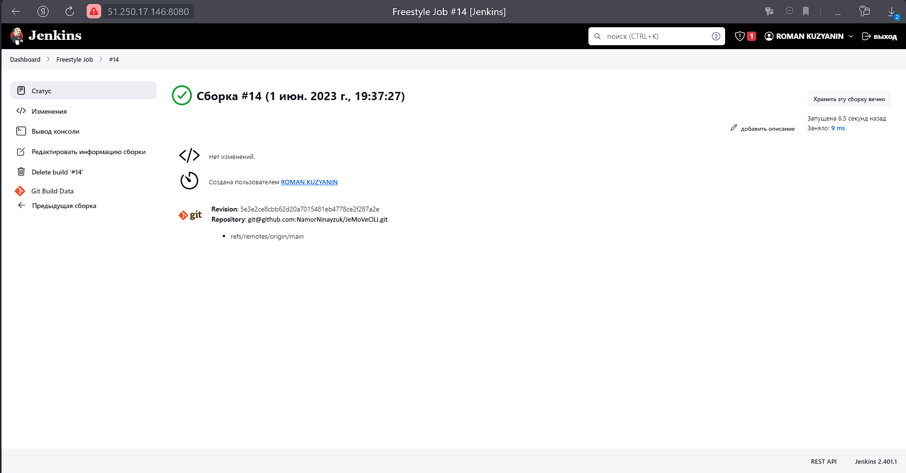
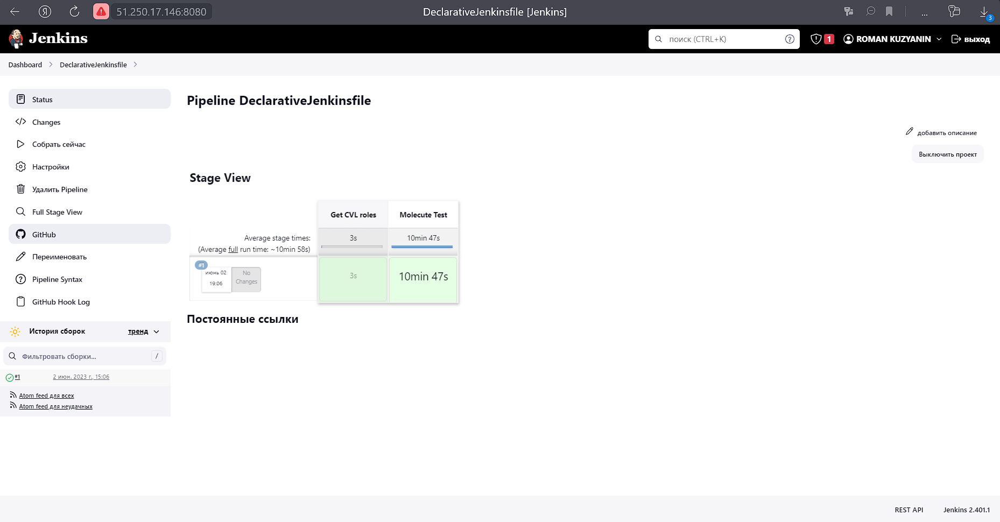
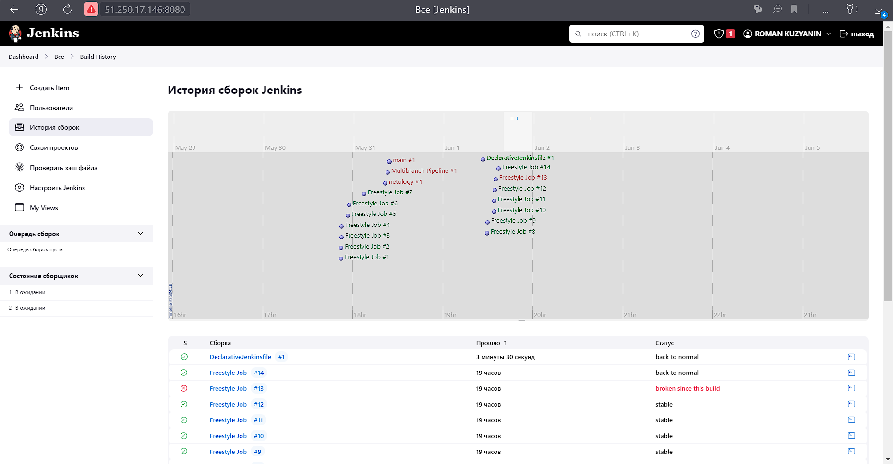
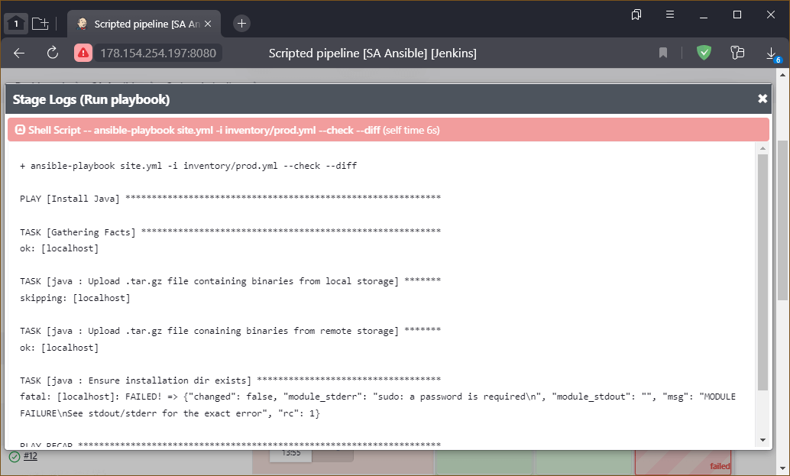

# Домашнее задание по лекции "9.4 Jenkins"

## Подготовка к выполнению

> 1. Создать 2 VM: для jenkins-master и jenkins-agent.
> 2. Установить jenkins при помощи playbook'a.
> 3. Запустить и проверить работоспособность.
> 4. Сделать первоначальную настройку.

Работа выполнялась в **Яндекс.Облаке**, поэтому использовался [Интерфейс командной строки Yandex Cloud](https://cloud.yandex.ru/docs/cli/quickstart)

Разворачивание ВМ выполнялось провайдером **Яндекс.Облака** для **terraform** с его [зеркала](https://cloud.yandex.ru/docs/tutorials/infrastructure-management/terraform-quickstart#install-terraform).
Готовые файлы инфраструктуры: основной [main.tf](09-ci-04-jenkins/infrastructure/cicd/hosts.yml) и модуль [vm-instance](09-ci-04-jenkins/infrastructure/vm-instance/main.tf) (содержит прямую ссылку на открытый ключ)


Разворачивание **Jenkins** и его агента выполняется через **ansible**: [основной playbook](09-ci-04-jenkins/infrastructure/site.yml), [структура нод](09-ci-04-jenkins/infrastructure/cicd/hosts.yml) и [переменные](09-ci-04-jenkins/infrastructure/cicd/group_vars/jenkins.yml)

Все необходимое для развертки в **bash** скрипте: [go.sh](go.sh)


<details>
<summary>Разворачивание инфраструктуры</summary>

```console
┌──(kali㉿kali)-[~/09-ci-04jenkins]
└─$  ./go.sh up

Terraform used the selected providers to generate the following execution plan. Resource actions are indicated with the
following symbols:
  + create

Terraform will perform the following actions:

  # yandex_compute_image.os-centos will be created
  + resource "yandex_compute_image" "os-centos" {
      + created_at      = (known after apply)
      + folder_id       = (known after apply)
      + id              = (known after apply)
      + min_disk_size   = (known after apply)
      + name            = "os-centos-stream"
      + os_type         = (known after apply)
      + pooled          = (known after apply)
      + product_ids     = (known after apply)
      + size            = (known after apply)
      + source_disk     = (known after apply)
      + source_family   = "centos-stream-8"
      + source_image    = (known after apply)
      + source_snapshot = (known after apply)
      + source_url      = (known after apply)
      + status          = (known after apply)
    }

  # yandex_vpc_network.my-net will be created
  + resource "yandex_vpc_network" "my-net" {
      + created_at                = (known after apply)
      + default_security_group_id = (known after apply)
      + folder_id                 = (known after apply)
      + id                        = (known after apply)
      + labels                    = (known after apply)
      + name                      = "cluster-network"
      + subnet_ids                = (known after apply)
    }

  # yandex_vpc_subnet.my-subnet will be created
  + resource "yandex_vpc_subnet" "my-subnet" {
      + created_at     = (known after apply)
      + folder_id      = (known after apply)
      + id             = (known after apply)
      + labels         = (known after apply)
      + name           = "cluster-subnet"
      + network_id     = (known after apply)
      + v4_cidr_blocks = [
          + "10.2.0.0/16",
        ]
      + v6_cidr_blocks = (known after apply)
      + zone           = "ru-central1-a"
    }

  # module.jen-master.yandex_compute_instance.vm-instance will be created
  + resource "yandex_compute_instance" "vm-instance" {
      + created_at                = (known after apply)
      + description               = "Jenkins Master"
      + folder_id                 = (known after apply)
      + fqdn                      = (known after apply)
      + hostname                  = (known after apply)
      + id                        = (known after apply)
      + metadata                  = {
          + "ssh-keys" = <<-EOT
                centos:ssh-ed25519 AAAAC3NzaC1lZDI1NTE5AAAAIMdZoMJuvYB/g/JmA+yMFCS6V0XANM7qZOqfT75WmJjA kali@kali
            EOT
        }
      + name                      = "jenkins-master-01"
      + network_acceleration_type = "standard"
      + platform_id               = "standard-v1"
      + service_account_id        = (known after apply)
      + status                    = (known after apply)
      + zone                      = (known after apply)

      + boot_disk {
          + auto_delete = true
          + device_name = "centos"
          + disk_id     = (known after apply)
          + mode        = (known after apply)

          + initialize_params {
              + block_size  = (known after apply)
              + description = (known after apply)
              + image_id    = (known after apply)
              + name        = (known after apply)
              + size        = 10
              + snapshot_id = (known after apply)
              + type        = "network-hdd"
            }
        }

      + network_interface {
          + index              = (known after apply)
          + ip_address         = (known after apply)
          + ipv4               = true
          + ipv6               = (known after apply)
          + ipv6_address       = (known after apply)
          + mac_address        = (known after apply)
          + nat                = true
          + nat_ip_address     = (known after apply)
          + nat_ip_version     = (known after apply)
          + security_group_ids = (known after apply)
          + subnet_id          = (known after apply)
        }

      + placement_policy {
          + host_affinity_rules = (known after apply)
          + placement_group_id  = (known after apply)
        }

      + resources {
          + core_fraction = 5
          + cores         = 2
          + memory        = 2
        }

      + scheduling_policy {
          + preemptible = (known after apply)
        }
    }

  # module.jen-slave[0].yandex_compute_instance.vm-instance will be created
  + resource "yandex_compute_instance" "vm-instance" {
      + created_at                = (known after apply)
      + description               = "Jenkins Slave Node 1"
      + folder_id                 = (known after apply)
      + fqdn                      = (known after apply)
      + hostname                  = (known after apply)
      + id                        = (known after apply)
      + metadata                  = {
          + "ssh-keys" = <<-EOT
                centos:ssh-ed25519 AAAAC3NzaC1lZDI1NTE5AAAAIMdZoMJuvYB/g/JmA+yMFCS6V0XANM7qZOqfT75WmJjA kali@kali
            EOT
        }
      + name                      = "jenkins-agent-01"
      + network_acceleration_type = "standard"
      + platform_id               = "standard-v1"
      + service_account_id        = (known after apply)
      + status                    = (known after apply)
      + zone                      = (known after apply)

      + boot_disk {
          + auto_delete = true
          + device_name = "centos"
          + disk_id     = (known after apply)
          + mode        = (known after apply)

          + initialize_params {
              + block_size  = (known after apply)
              + description = (known after apply)
              + image_id    = (known after apply)
              + name        = (known after apply)
              + size        = 10
              + snapshot_id = (known after apply)
              + type        = "network-hdd"
            }
        }

      + network_interface {
          + index              = (known after apply)
          + ip_address         = (known after apply)
          + ipv4               = true
          + ipv6               = (known after apply)
          + ipv6_address       = (known after apply)
          + mac_address        = (known after apply)
          + nat                = true
          + nat_ip_address     = (known after apply)
          + nat_ip_version     = (known after apply)
          + security_group_ids = (known after apply)
          + subnet_id          = (known after apply)
        }

      + placement_policy {
          + host_affinity_rules = (known after apply)
          + placement_group_id  = (known after apply)
        }

      + resources {
          + core_fraction = 20
          + cores         = 2
          + memory        = 4
        }

      + scheduling_policy {
          + preemptible = (known after apply)
        }
    }

Plan: 5 to add, 0 to change, 0 to destroy.

Changes to Outputs:
  + master_ip = (known after apply)
  + slave_ip  = [
      + (known after apply),
    ]
yandex_vpc_network.my-net: Creating...
yandex_compute_image.os-centos: Creating...
yandex_vpc_network.my-net: Creation complete after 2s [id=enpbhup5ssqa6ndcfpqs]
yandex_vpc_subnet.my-subnet: Creating...
yandex_vpc_subnet.my-subnet: Creation complete after 1s [id=e9buecm6olupomr0fgv1]
yandex_compute_image.os-centos: Still creating... [10s elapsed]
yandex_compute_image.os-centos: Creation complete after 11s [id=fd8k3bul4jhiafo87q5t]
module.jen-slave[0].yandex_compute_instance.vm-instance: Creating...
module.jen-master.yandex_compute_instance.vm-instance: Creating...
module.jen-slave[0].yandex_compute_instance.vm-instance: Still creating... [10s elapsed]
module.jen-master.yandex_compute_instance.vm-instance: Still creating... [10s elapsed]
module.jen-slave[0].yandex_compute_instance.vm-instance: Still creating... [20s elapsed]
module.jen-master.yandex_compute_instance.vm-instance: Still creating... [20s elapsed]
module.jen-slave[0].yandex_compute_instance.vm-instance: Still creating... [30s elapsed]
module.jen-master.yandex_compute_instance.vm-instance: Still creating... [30s elapsed]
module.jen-master.yandex_compute_instance.vm-instance: Still creating... [40s elapsed]
module.jen-slave[0].yandex_compute_instance.vm-instance: Still creating... [40s elapsed]
module.jen-master.yandex_compute_instance.vm-instance: Still creating... [50s elapsed]
module.jen-slave[0].yandex_compute_instance.vm-instance: Still creating... [50s elapsed]
module.jen-master.yandex_compute_instance.vm-instance: Still creating... [1m0s elapsed]
module.jen-slave[0].yandex_compute_instance.vm-instance: Still creating... [1m0s elapsed]
module.jen-slave[0].yandex_compute_instance.vm-instance: Creation complete after 1m1s [id=fhml6hg70ruicnjjpegm]
module.jen-master.yandex_compute_instance.vm-instance: Creation complete after 1m1s [id=fhm90et921n53rnjgpks]

Apply complete! Resources: 5 added, 0 changed, 0 destroyed.

Outputs:

master_ip = "51.250.17.146"
slave_ip = [
  "51.250.3.1",
]
┌──(kali㉿kali)-[~/09-ci-04jenkins]
└─$  ./go.sh deploy

PLAY [Generate dynamic inventory] **************************************************************************************

TASK [Get instances from Yandex.Cloud CLI] *****************************************************************************
ok: [localhost]

TASK [Set instances to facts] ******************************************************************************************
ok: [localhost]

TASK [Add instances IP to hosts] ***************************************************************************************
ok: [localhost] => (item={'id': 'fhm90et921n53rnjgpks', 'folder_id': 'b1g3ol70h1opu6hr9kie', 'created_at': '2023-10-31T11:22:41Z', 'name': 'jenkins-master-01', 'description': 'Jenkins Master', 'zone_id': 'ru-central1-a', 'platform_id': 'standard-v1', 'resources': {'memory': '2147483648', 'cores': '2', 'core_fraction': '5'}, 'status': 'RUNNING', 'metadata_options': {'gce_http_endpoint': 'ENABLED', 'aws_v1_http_endpoint': 'ENABLED', 'gce_http_token': 'ENABLED', 'aws_v1_http_token': 'ENABLED'}, 'boot_disk': {'mode': 'READ_WRITE', 'device_name': 'centos', 'auto_delete': True, 'disk_id': 'fhm90knlb6e2d1hiqi2a'}, 'network_interfaces': [{'index': '0', 'mac_address': 'd0:0d:90:3b:a9:10', 'subnet_id': 'e9buecm6olupomr0fgv1', 'primary_v4_address': {'address': '10.2.0.26', 'one_to_one_nat': {'address': '51.250.17.146', 'ip_version': 'IPV4'}}}], 'fqdn': 'fhm90et921n53rnjgpks.auto.internal', 'scheduling_policy': {}, 'network_settings': {'type': 'STANDARD'}, 'placement_policy': {}})
ok: [localhost] => (item={'id': 'fhml6hg70ruicnjjpegm', 'folder_id': 'b1g3ol70h1opu6hr9kie', 'created_at': '2023-10-31T11:22:41Z', 'name': 'jenkins-agent-01', 'description': 'Jenkins Slave Node 1', 'zone_id': 'ru-central1-a', 'platform_id': 'standard-v1', 'resources': {'memory': '4294967296', 'cores': '2', 'core_fraction': '20'}, 'status': 'RUNNING', 'metadata_options': {'gce_http_endpoint': 'ENABLED', 'aws_v1_http_endpoint': 'ENABLED', 'gce_http_token': 'ENABLED', 'aws_v1_http_token': 'ENABLED'}, 'boot_disk': {'mode': 'READ_WRITE', 'device_name': 'centos', 'auto_delete': True, 'disk_id': 'fhmiubt6uodfipkp90v9'}, 'network_interfaces': [{'index': '0', 'mac_address': 'd0:0d:15:34:60:70', 'subnet_id': 'e9buecm6olupomr0fgv1', 'primary_v4_address': {'address': '10.2.0.10', 'one_to_one_nat': {'address': '51.250.3.1', 'ip_version': 'IPV4'}}}], 'fqdn': 'fhml6hg70ruicnjjpegm.auto.internal', 'scheduling_policy': {}, 'network_settings': {'type': 'STANDARD'}, 'placement_policy': {}})

TASK [Check instance count] ********************************************************************************************
ok: [localhost] => {
    "msg": "Total instance count: 2"
}

PLAY [Approve SSH fingerprint] *****************************************************************************************

TASK [Check known_hosts for] *******************************************************************************************
ok: [jenkins-master-01 -> localhost]
ok: [jenkins-agent-01 -> localhost]

TASK [Skip question for adding host key] *******************************************************************************
ok: [jenkins-master-01]
ok: [jenkins-agent-01]

TASK [Add SSH fingerprint to known host] *******************************************************************************
ok: [jenkins-agent-01]
ok: [jenkins-master-01]

PLAY [Preapre all hosts] ***********************************************************************************************

TASK [Gathering Facts] *************************************************************************************************
ok: [jenkins-master-01]
ok: [jenkins-agent-01]

TASK [Create group] ****************************************************************************************************
changed: [jenkins-agent-01]
changed: [jenkins-master-01]

TASK [Create user] *****************************************************************************************************
changed: [jenkins-agent-01]
changed: [jenkins-master-01]

TASK [Echo Public Key] *************************************************************************************************
ok: [jenkins-master-01] => {
    "ssh_key_info['ssh_public_key']": "ssh-rsa AAAAB3NzaC1yc2EAAAADAQABAAABgQChaQp2Upzkg7QDUdk6rtj3fLTGJcegS13JD74id1MGxRzZeZJFLuDowP31kKCkorgff8lqGsNOq5zczHiMHWMAX7TbQaoNFrYv57nAY/FEl8D/FNw8ZURV/b/V8WZW69LzSz74WNzwYMzWHoWEFfL7OLQydR8jCAZcYWGyaiWf+3KlUIIwnjYGUMyIHJ4QRlZeS4WJBrrGQiWnuG51UnD6AYGFHihzJiPoF1jxbFfQz5Wf+LzWzaD8dPlswoUXz45p+0ZLRN4h+JhMAebyao0D40ukzqPehGEsrkyBsUMhI9BqoYgU/I36oGTqKFNjEiDVV3kTd5tfwSVVe92Grm6FvUmVnHbbzBuiojODGj4sIKvYqyOsC87W04GUr54qUzS4ugizhcAoO0iIa9kjmv5pvPOSoFRX17ab2cBZbW/2Ta13TKpRHVyYs+LeksuoAzPb6cgHyeCFLQZEVrZ59sqrARVBlCtrpKFRovkFZe9mKFm/YMyByJfahN+E54Etxt0= ansible-generated on fhm90et921n53rnjgpks.auto.internal"
}
ok: [jenkins-agent-01] => {
    "ssh_key_info['ssh_public_key']": "ssh-rsa AAAAB3NzaC1yc2EAAAADAQABAAABgQCe6mPN/totoYhT2xHuRqSUb++lykkgS2W8k3SuYbC99G6DD/j9kNSJ4lCT0JEjMJj53XegRvHzGlQTxjEl0xJBFS+HP03n7uDvMaEuA6B7jG3LjzwPhvasbtRvv39bZMIHmOG3kufH2zu7SAnKg3Reafzf+ZwF7eqzWxoGYHlt3wZf42hw9zH6vdX2eWczmMNnOTcNiJqJ4K4iX3xStbpL84OJsC69xJcDQ8m70CPvOKtrMxRTbHuiKU9oDV4oWHB+sO8y+Pf97SsjWGGX1UUwir00jFG4YFSTR97ZxgA2U2fJyzrnYtSwIGaO/LaJCFTb7QrgrRVYY2rX/FJxqa6Cv+Wca7EVvGIqMbcKNE27NA83H54sS/yWqmgYs6ex9aKLc5GEjmRVDs4ebPRUTHlYMm4gAIuBjAi0KqKDiJirp0gQbt/Y2nGJMxeV4i5/DbAi07vR6qY3vVfTk9Qwlk3mxjTixwsOtUufp2CO7IAGR01j6lbqChDeuNtZw2Rw/FU= ansible-generated on fhml6hg70ruicnjjpegm.auto.internal"
}

TASK [Install JDK] *****************************************************************************************************
changed: [jenkins-master-01]
changed: [jenkins-agent-01]

TASK [Ensure GitHub are present in known_hosts file] *******************************************************************
# github.com:22 SSH-2.0-babeld-ea310e90
# github.com:22 SSH-2.0-babeld-ea310e90
# github.com:22 SSH-2.0-babeld-ea310e90
# github.com:22 SSH-2.0-babeld-ea310e90
# github.com:22 SSH-2.0-babeld-ea310e90
# github.com:22 SSH-2.0-babeld-ea310e90
# github.com:22 SSH-2.0-babeld-ea310e90
# github.com:22 SSH-2.0-babeld-ea310e90
# github.com:22 SSH-2.0-babeld-ea310e90
# github.com:22 SSH-2.0-babeld-ea310e90
[WARNING]: Module remote_tmp /home/jenkins/.ansible/tmp did not exist and was created with a mode of 0700, this may
cause issues when running as another user. To avoid this, create the remote_tmp dir with the correct permissions
manually
changed: [jenkins-master-01]
changed: [jenkins-agent-01]

PLAY [Get Jenkins master installed] ************************************************************************************

TASK [Gathering Facts] *************************************************************************************************
ok: [jenkins-master-01]

TASK [Get repo Jenkins] ************************************************************************************************
changed: [jenkins-master-01]

TASK [Add Jenkins key] *************************************************************************************************
changed: [jenkins-master-01]

TASK [Install epel-release] ********************************************************************************************
changed: [jenkins-master-01]

TASK [Install Jenkins and requirements] ********************************************************************************
changed: [jenkins-master-01]

TASK [Ensure jenkins agents are present in known_hosts file] ***********************************************************
# 51.250.3.1:22 SSH-2.0-OpenSSH_8.0
# 51.250.3.1:22 SSH-2.0-OpenSSH_8.0
# 51.250.3.1:22 SSH-2.0-OpenSSH_8.0
# 51.250.3.1:22 SSH-2.0-OpenSSH_8.0
# 51.250.3.1:22 SSH-2.0-OpenSSH_8.0
changed: [jenkins-master-01] => (item=jenkins-agent-01)

TASK [Start Jenkins] ***************************************************************************************************
changed: [jenkins-master-01]

TASK [Get initial password] ********************************************************************************************
ok: [jenkins-master-01]

TASK [Echo initial password] *******************************************************************************************
ok: [jenkins-master-01] => {
    "msg": "Use it to complete initialization: 1778e36f5a514defa49f414865bec9b5"
}

TASK [Commands to get private key] *************************************************************************************
ok: [jenkins-master-01] => {
    "msg": "ssh centos@51.250.17.146 sudo cat /home/jenkins/.ssh/id_rsa"
}

PLAY [Prepare jenkins agent] *******************************************************************************************

TASK [Gathering Facts] *************************************************************************************************
ok: [jenkins-agent-01]

TASK [Add master publickey into authorized_key] ************************************************************************
changed: [jenkins-agent-01]

TASK [Create agent_dir] ************************************************************************************************
changed: [jenkins-agent-01]

TASK [Add docker repo] *************************************************************************************************
changed: [jenkins-agent-01]

TASK [Install some required] *******************************************************************************************
changed: [jenkins-agent-01]

TASK [Update pip] ******************************************************************************************************
changed: [jenkins-agent-01]

TASK [Install Ansible 2.13.5] ******************************************************************************************
changed: [jenkins-agent-01]

TASK [Install Molecule] ************************************************************************************************
changed: [jenkins-agent-01]

TASK [Install Python 3.6] **********************************************************************************************
changed: [jenkins-agent-01]

TASK [Add local to PATH] ***********************************************************************************************
changed: [jenkins-agent-01]

TASK [Create docker group] *********************************************************************************************
ok: [jenkins-agent-01]

TASK [Add jenkinsuser to dockergroup] **********************************************************************************
changed: [jenkins-agent-01]

TASK [Restart docker] **************************************************************************************************
changed: [jenkins-agent-01]

TASK [Install agent.jar] ***********************************************************************************************
changed: [jenkins-agent-01]

TASK [Agent configuration] *********************************************************************************************
ok: [jenkins-agent-01] => {
    "msg": "To configure agent node use: ssh 51.250.3.1 java -jar /opt/jenkins_agent/agent.jar"
}

PLAY RECAP *************************************************************************************************************
jenkins-agent-01           : ok=24   changed=16   unreachable=0    failed=0    skipped=0    rescued=0    ignored=0
jenkins-master-01          : ok=19   changed=10   unreachable=0    failed=0    skipped=0    rescued=0    ignored=0
localhost                  : ok=4    changed=0    unreachable=0    failed=0    skipped=0    rescued=0    ignored=0

+----------------------+-------------------+---------------+---------+-----------------+-------------+
|          ID          |       NAME        |    ZONE ID    | STATUS  |   EXTERNAL IP   | INTERNAL IP |
+----------------------+-------------------+---------------+---------+-----------------+-------------+
| fhm90et921n53rnjgpks | jenkins-master-01 | ru-central1-a | RUNNING | 51.250.17.146 | 10.2.0.26   |
| fhml6hg70ruicnjjpegm | jenkins-agent-01  | ru-central1-a | RUNNING | 51.250.3.1  | 10.2.0.10   |
+----------------------+-------------------+---------------+---------+-----------------+-------------+

┌──(kali㉿kali)-[~/09-ci-04jenkins]
└─$ 
```

</details>

Для решения этой задачи в качестве экспереминта решил собрать стек коллекции под названием **JeMoVeClLi**.
 В ней используются роли предыдущих задач (**Clickhouse** + **Vector** + **Lighthouse**),а так же добавлены скрипты для **Jenkins** и тестирование посредством **Molecule**.


---

## Основная часть

### 1. Сделать Freestyle Job, который будет запускать `molecule test` из любого вашего репозитория с ролью.



---

### 2. Сделать Declarative Pipeline Job, который будет запускать `molecule test` из любого вашего репозитория с ролью.

Готовый скрипт для **pipeline**

```jenkins
pipeline {
    agent any

    stages {
        stage('Get CVL roles') {
            steps {
                git branch: 'main', credentialsId: 'sa-github', url: 'git@github.com:NamorNinayzuk/JeMoVeClLi.git'
            }
        }
        stage('Molecute Test') {
            steps {
                sh 'molecule test'
            }
        }
    }
}
```



---

### 3. Перенести Declarative Pipeline в репозиторий в файл `Jenkinsfile`.

~~Так как имя файла `Jenkinsfile` будет использоваться в следующей задаче, декларативный **pipeline** сохранён в файл с именем `DeclarativeJenkinsfile`~~

---

### 4. Создать Multibranch Pipeline на запуск `Jenkinsfile` из репозитория.

> Использовать `Jenkinsfile` из предыдущего задания считаю не корректным, ибо в нём явно прописано извлечение конкретной ветки, что делает его содержимое избыточным.
> **Multibranch** уже извлекает всё содержимое нужной ветки.
> И если этот файл в обязательном порядке не менять в каждой ветке, не до конца понятно что будет собираться: извлечённая ветка от **multibranch** или та, которую извлёк скрипт.
> Данное поведение, я, к сожалению, проверить не догадался.
> В данном решении файлы `Jenkinsfile` разные из-за наличия в них маркеров (первый шаг) - без них файл можно было бы сделать единым для всех веток.

Для проверки решения в имеющемся репозиторий **JeMoVeClLi** создан файл `Jenkinsfile` со следующим содержимым:

```jenkins
pipeline {
    agent any

    stages {
        stage('Main branch') {
            steps {
                echo 'MAIN'
            }
        }
        stage('Molecute Test') {
            steps {
                sh 'molecule test'
            }
        }
    }
}
```
> **Pipeline** состоит из двух этапов, где первый является своеобразным маркером ветки (выводит текст `MAIN` и имеет соответствующее название), а второй запускает тестирование **Molecule**

В **playbook** этапа **Molecule converge** добавлен **play** со следующим содержимым:

```yaml
- name: Project name
  hosts: localhost
  gather_facts: false
  tasks:
    - name: Project branch
      ansible.builtin.debug:
        msg: "It is MAIN branch"
```
> Также служит "маркером" исполняемой ветки

Далее от основной ветки `main` создано ответвление `second`, где перечисленные выше файлы изменены следующим образом:

Файл `Jenkinsfile`

```jenkins
pipeline {
    agent any

    stages {
        stage('Second branch') {
            steps {
                echo 'SECOND'
            }
        }
        stage('Molecute Test') {
            steps {
                sh 'molecule test'
            }
        }
    }
}
```

Изменённый **play** файла `molecule/default/converge.yml`:

```yaml
- name: Project name
  hosts: localhost
  gather_facts: false
  tasks:
    - name: Project branch
      ansible.builtin.debug:
        msg: "It is SECOND branch"
```

При сохранении конфигурации проекта выполняется сканирование репозитория в соответствии с настройками проекта для поиска нужных ссылок (веток, тегов и т.д.) - в данном случае ищутся только ветки.
Лог обработки выглядит подобным образом:

```console
Started
[Wed May 31 15:15:43 UTC 2023] Starting branch indexing...
 > git --version # timeout=10
 > git --version # 'git version 2.31.1'
using GIT_SSH to set credentials 
[INFO] Currently running in a labeled security context
[INFO] Currently SELinux is 'enforcing' on the host
 > /usr/bin/chcon --type=ssh_home_t /tmp/jenkins-gitclient-ssh9349166857291373915.key
Verifying host key using known hosts file
 > git ls-remote --symref -- git@github.com:NamorNinayzuk/JeMoVeClLi.git # timeout=10
Creating git repository in /var/lib/jenkins/caches/git-f69dbc5e9c49bafa75a1f1623749dd2b
 > git init /var/lib/jenkins/caches/git-f69dbc5e9c49bafa75a1f1623749dd2b # timeout=10
Setting origin to git@github.com:NamorNinayzuk/JeMoVeClLi.git
 > git config remote.origin.url git@github.com:NamorNinayzuk/JeMoVeClLi.git # timeout=10
Fetching & pruning origin...
Listing remote references...
 > git config --get remote.origin.url # timeout=10
 > git --version # timeout=10
 > git --version # 'git version 2.31.1'
using GIT_SSH to set credentials 
[INFO] Currently running in a labeled security context
[INFO] Currently SELinux is 'enforcing' on the host
 > /usr/bin/chcon --type=ssh_home_t /var/lib/jenkins/caches/git-f69dbc5e9c49bafa75a1f1623749dd2b@tmp/jenkins-gitclient-ssh4565873836439757084.key
Verifying host key using known hosts file
 > git ls-remote -h -- git@github.com:NamorNinayzuk/JeMoVeClLi.git # timeout=10
Fetching upstream changes from origin
 > git config --get remote.origin.url # timeout=10
using GIT_SSH to set credentials 
[INFO] Currently running in a labeled security context
[INFO] Currently SELinux is 'enforcing' on the host
 > /usr/bin/chcon --type=ssh_home_t /var/lib/jenkins/caches/git-f69dbc5e9c49bafa75a1f1623749dd2b@tmp/jenkins-gitclient-ssh16470572433904368790.key
Verifying host key using known hosts file
 > git fetch --tags --force --progress --prune -- origin +refs/heads/*:refs/remotes/origin/* # timeout=10
Checking branches...
  Checking branch main
      ‘Jenkinsfile’ found
    Met criteria
Scheduled build for branch: main
  Checking branch second
      ‘Jenkinsfile’ found
    Met criteria
Scheduled build for branch: second
Processed 2 branches
[Wed May 31 15:15:52 UTC 2023] Finished branch indexing. Indexing took 8.6 sec
Finished: SUCCESS
```




Запуск сборок отдельно ожидаемо сбоев не дал.

Использование разных веток подтверждается как визуально, так и в логах сборки:

Вывод текста `MAIN` из одного из **stage** для **pipeline** основной **main** ветки


Вывод кусочка лога с текстом `It is SECOND branch` из вывода **playbook** второй (**second**) ветки


---

### 5. Создать Scripted Pipeline, наполнить его скриптом из [pipeline](./pipeline).

В исходном скрипте:
```jenkins
node("linux"){
    stage("Git checkout"){
        git credentialsId: '5ac0095d-0185-431b-94da-09a0ad9b0e2c', url: 'git@github.com:aragastmatb/example-playbook.git'
    }
    stage("Sample define secret_check"){
        secret_check=true
    }
    stage("Run playbook"){
        if (secret_check){
            sh 'ansible-playbook site.yml -i inventory/prod.yml'
        }
        else{
            echo 'need more action'
        }
        
    }
}
```

единственное, что нужно поменять - это `credentialsId` - сохранённый в секретах **credentals** доступа к **GitHub** (скорее всего **private** ключ)

Так как я раньше уже сохранял свой аналогичный **credentals**, то можно использовать его:
```jenkins
node("linux"){
    stage("Git checkout"){
        git credentialsId: 'sa-github', url: 'git@github.com:aragastmatb/example-playbook.git'
    }
    stage("Sample define secret_check"){
        secret_check=true
    }
    stage("Run playbook"){
        if (secret_check){
            sh 'ansible-playbook site.yml -i inventory/prod.yml'
        }
        else{
            echo 'need more action'
        }
        
    }
}
```

Однако, в скрипте указано использование агента с меткой `linux`.
Поэтому для того, чтобы запланированная сборка могла быть отправлена агенту на выполнение нужно:
  - либо убрать требование метки - заменить строчку `node("linux"){` на `node{`
  - либо добавить соответствующую метку ноде агента

Для решения выбран вариант добавления меток `linux ansible molecule`

---

### 6. Внести необходимые изменения, чтобы Pipeline запускал `ansible-playbook` без флагов `--check --diff`, если не установлен параметр при запуске джобы (prod_run = True), по умолчанию параметр имеет значение False и запускает прогон с флагами `--check --diff`.

Условия попроще:
  - Добавить параметр сборки `prod_run`
  - Если параметр не установлен (что эквивалентно значению `false`) запускать `ansible-playbook` с флагами `--check --diff`
  - Иначе (если параметр имеет значение true) запускать `ansible-playbook` без флагов

Готовый скрипт:
```jenkins
node("linux"){
    stage("Git checkout"){
        git credentialsId: 'sa-github', url: 'git@github.com:aragastmatb/example-playbook.git'
    }
    stage("Run playbook"){
        if (params.prod_line == true) {
            sh 'ansible-playbook site.yml -i inventory/prod.yml'
        }
        else
        {
            sh 'ansible-playbook site.yml -i inventory/prod.yml --check --diff'
        }
        
    }
}
```

Параметризированная сборка выглядит так:


---

### 7. Проверить работоспособность, исправить ошибки, исправленный Pipeline вложить в репозиторий в файл `ScriptedJenkinsfile`.

При исполнени **playbook** появляется ошибка:


```console
TASK [java : Ensure installation dir exists] ***********************************
fatal: [localhost]: FAILED! => {"changed": false, "module_stderr": "sudo: a password is required\n", "module_stdout": "", "msg": "MODULE FAILURE\nSee stdout/stderr for the exact error", "rc": 1}
```

Из вообщения видно, что **ansible** пытается выполнить команду с повышенными привелегиями (**sudo**), но соответствующий пароль не задан.
Проблему можно решить разными способами - подробнее в статье [Ansible – “sudo: a password is required”](https://www.shellhacks.com/ansible-sudo-a-password-is-required/)

Я выбрал вариант попроще, а именно - не спрашивать пароль для `sudo` операций пользователя `jenkins` для чего нужно:
  - Подключиться к ноде агента: `ssh centos@51.250.3.1`
  - Выполнить команду `sudo visudo`
  - Добавить в конец файла строку `jenkins  ALL=(ALL) NOPASSWD:ALL`

После внесённых изменений сборка проходит успешно при любом значении параметра:

> На скриншоте сборка состоит из трёх шагов - средний я добавил для уверенности, что сборка запускается от пользователя `jenkins`

---

### 8. Отправить ссылку на репозиторий с ролью и Declarative Pipeline и Scripted Pipeline.

Репозиторий решения: [JeMoVeClLi](https://github.com/NamorNinayzuk/JeMoVeClLi) - содержит:
  - Сценарий проверки ролей стека **Clickhouse+Vector+Lighthouse**
  - Две ветки для **Multibranch pipeline**: `main` и `second` - используется файл **Jenkinsfile**
  - Основная ветка **main** содержит Файл `DeclarativeJenkinsfile` для **Declarative pipeline**
  - Основная ветка **main** содержит Файл `ScriptedJenkinsfile` для **Scripted pipeline** (включает отладочный шаг `id`)
  - Основная ветка **main** содержит файл `ScriptedCVLstackJenkinsfile` из второй дополнительной задачи

---

