# Домашнее задание к занятию "09.05 Teamcity"

## Подготовка к выполнению

1. В Ya.Cloud создайте новый инстанс (4CPU4RAM) на основе образа `jetbrains/teamcity-server`
2. Дождитесь запуска teamcity, выполните первоначальную настройку
3. Создайте ещё один инстанс(2CPU4RAM) на основе образа `jetbrains/teamcity-agent`. Пропишите к нему переменную окружения `SERVER_URL: "http://<teamcity_url>:8111"`
4. Авторизуйте агент
5. Сделайте fork [репозитория](https://github.com/aragastmatb/example-teamcity)
6. Создать VM (2CPU4RAM) и запустить [playbook](./infrastructure)

## Основная часть

1. Создайте новый проект в teamcity на основе fork
* Создаем проект:

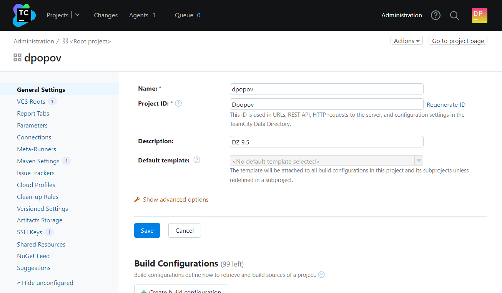

2. Сделайте autodetect конфигурации
* Делаем автодетект конфигурации:

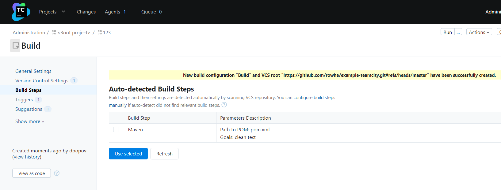

3. Сохраните необходимые шаги, запустите первую сборку master'a

* Запускаем сборку, убеждаемся, что она появилась в nexus

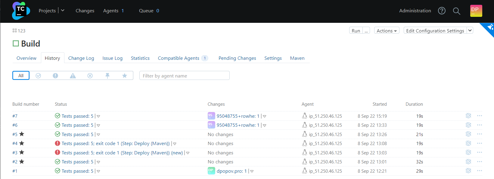


4. Поменяйте условия сборки: если сборка по ветке `master`, то должен происходит `mvn clean deploy`, иначе `mvn clean test`

* Настраиваем шаги сбоки:

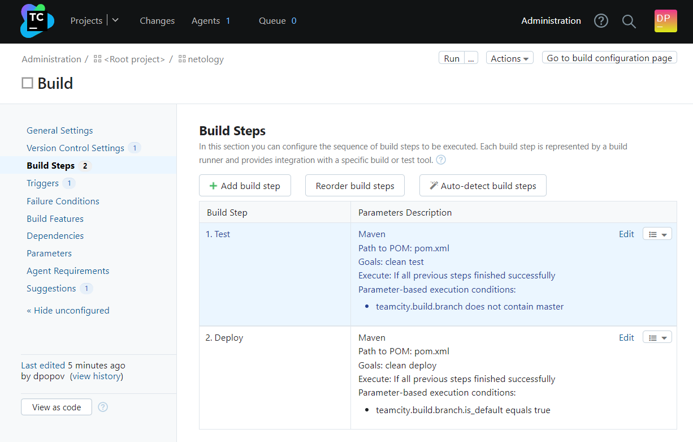
5. Для deploy будет необходимо загрузить [settings.xml](./teamcity/settings.xml) в набор конфигураций maven у teamcity, предварительно записав туда креды для подключения к nexus

* Меняем данные `settings.xml` и добавляем в шаг Deploy

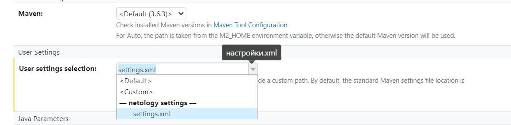
6. В pom.xml необходимо поменять ссылки на репозиторий и nexus

* В pom.xml указываем правильный адрес репозитория Maven
```shell
<distributionManagement>
                <repository>
                                <id>nexus</id>
                                <url>http://51.250.41.105/:8081/repository/maven-releases</url>
                </repository>
</distributionManagement>
```
7. Запустите сборку по master, убедитесь что всё прошло успешно, артефакт появился в nexus

* Запускаем сборку, убеждаемся, что артефакт загружается в Maven

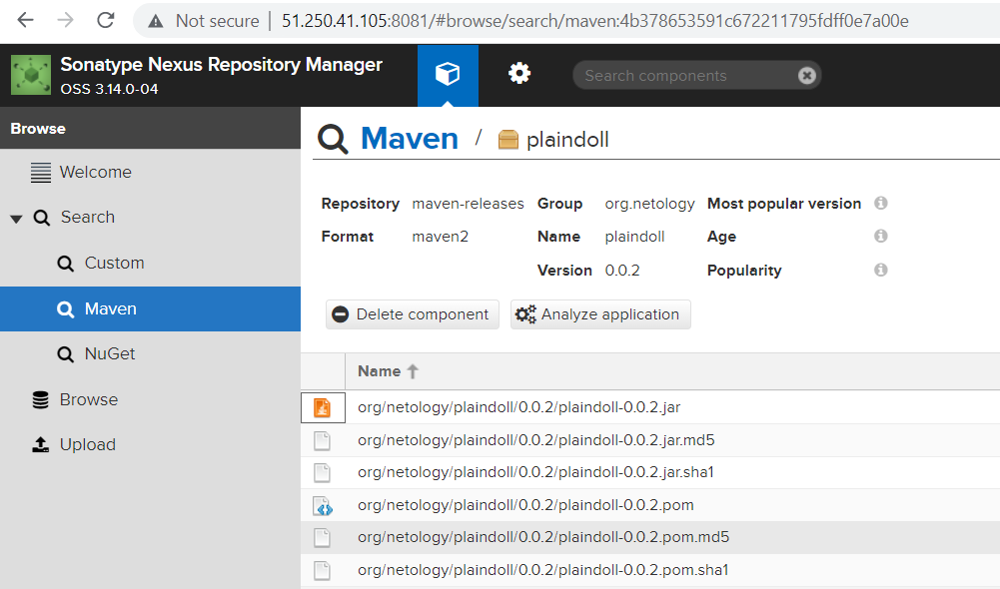

8. Мигрируйте `build configuration` в репозиторий

* Отправляем настройки тимсити в репозиторий:

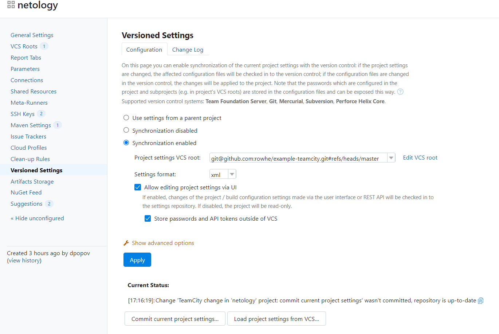

9. Создайте отдельную ветку `feature/add_reply` в репозитории

* Добавляем новую ветку

```shell
git checkout -b feature/add_reply master^0 --
Switched to a new branch 'feature/add_reply'
```
10. Напишите новый метод для класса Welcomer: метод должен возвращать произвольную реплику, содержащую слово `hunter`

* Добавляем новый метод
```shell
public String sayAnother(){
		return "need another gold";
	}
```
11. Дополните тест для нового метода на поиск слова `hunter` в новой реплике

* Добавляем тест для нового метода
```shell
@Test
	public void welcomerSaysAnother(){
		assertThat(welcomer.saySome(), containsString("another"));
	}
```
12. Сделайте push всех изменений в новую ветку в репозиторий

* Делаем пуш изменений в новую ветку
```shell
git commit
git push
```
13. Убедитесь что сборка самостоятельно запустилась, тесты прошли успешно

* Проверяем успешность сборки

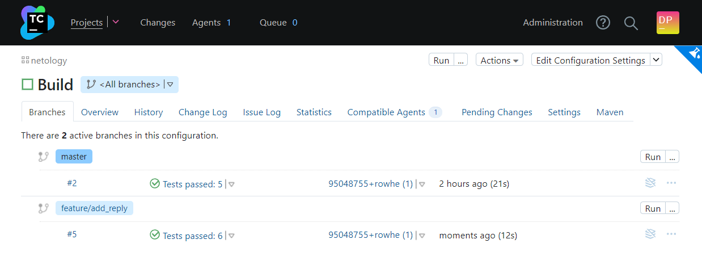
14. Внесите изменения из произвольной ветки `feature/add_reply` в `master` через `Merge`

* Делаем пул-реквест из `reature/add_reply` в `master`

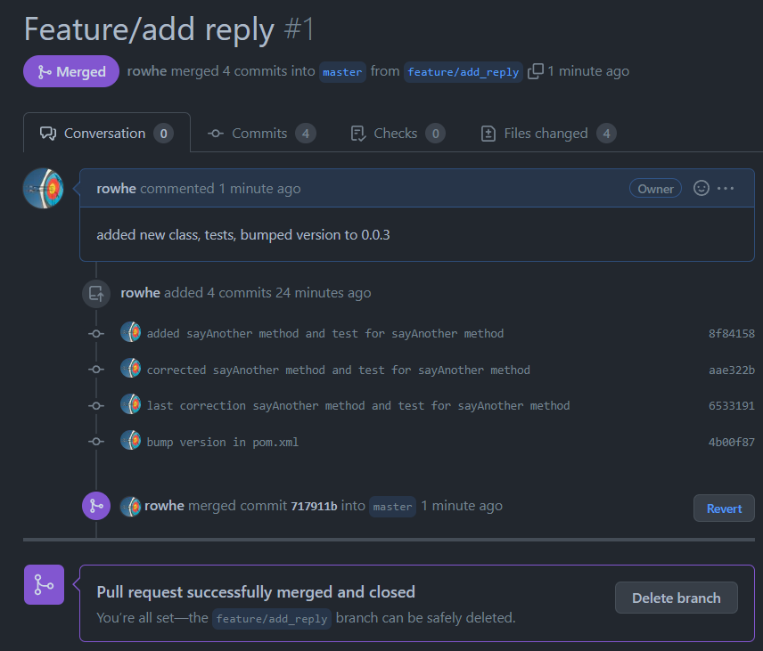
15. Убедитесь, что нет собранного артефакта в сборке по ветке `master`

* Убеждаемся в отсутствии собранных по ветке `master` во время me 
16. Настройте конфигурацию так, чтобы она собирала `.jar` в артефакты сборки

* Устанавливаем сборку в `.jar`

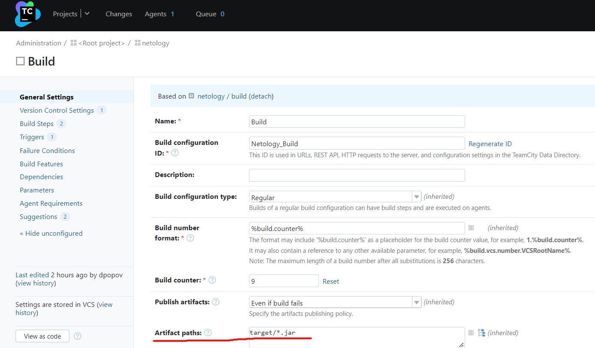

17. Проведите повторную сборку мастера, убедитесь, что сбора прошла успешно и артефакты собраны

* Проводим повторную сборку, убеждаемся, что артефакты собраны

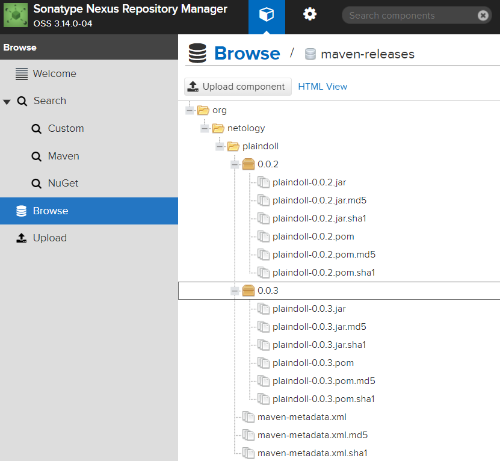

18. Проверьте, что конфигурация в репозитории содержит все настройки конфигурации из teamcity

* Убеждаемся, что в репозитории сохранились настройки teamcity

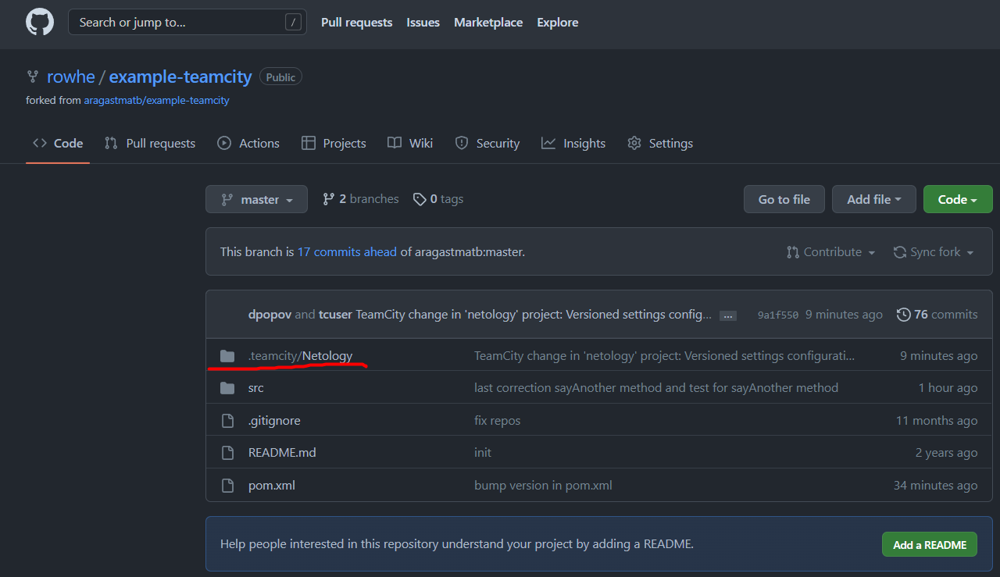

19. В ответ предоставьте ссылку на репозиторий

* Ссылка на репозиторий
[example-teamcity](https://github.com/rowhe/example-teamcity.git)
---

### Как оформить ДЗ?

Выполненное домашнее задание пришлите ссылкой на .md-файл в вашем репозитории.

---
