# Домашнее задание к занятию "09.06 Gitlab"

## Подготовка к выполнению

1. Необходимо [подготовить gitlab к работе по инструкции](https://cloud.yandex.ru/docs/tutorials/infrastructure-management/gitlab-containers)
2. Создайте свой новый проект
3. Создайте новый репозиторий в gitlab, наполните его [файлами](./repository)
4. Проект должен быть публичным, остальные настройки по желанию

* Проверяем работу запущенного GitLab

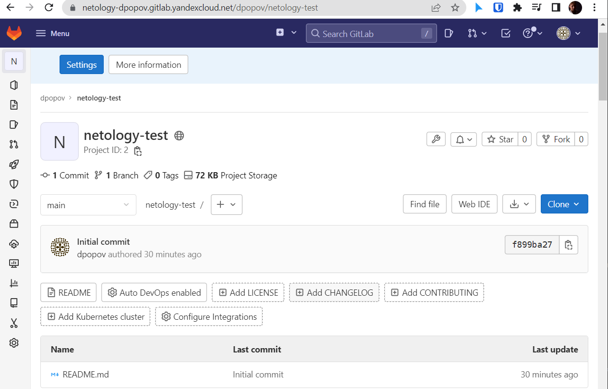

## Основная часть

### DevOps

В репозитории содержится код проекта на python. Проект - RESTful API сервис. Ваша задача автоматизировать сборку образа с выполнением python-скрипта:
1. Образ собирается на основе [centos:7](https://hub.docker.com/_/centos?tab=tags&page=1&ordering=last_updated)
2. Python версии не ниже 3.7

* Создаем Dockerfile
```shell
FROM centos:7

RUN yum install python3 python3-pip -y
ADD requirements.txt requirements.txt
RUN pip3 install -r requirements.txt
ADD python_api/python_api.py python_api.py
CMD ["python3", "python_api.py"]
```
3. Установлены зависимости: `flask` `flask-jsonpify` `flask-restful`

* Устанавливаем зависимости через файл requirements.txt
```shell
flask
flask_restful
```
4. Создана директория `/python_api`
5. Скрипт из репозитория размещён в /python_api

* Размещаем скрипт `python_api.py` в директори `python_api`


6. Точка вызова: запуск скрипта

* Указываем точку вызова в Dockerfile

```shell
CMD ["python3", "python_api.py"]
```

7. Если сборка происходит на ветке `master`: должен подняться pod kubernetes на основе образа `python-api`, иначе этот шаг нужно пропустить

* Создаем файл сбоки .gitlab-ci.yml

```shell

stages:
  - build
  - deploy


build:
  stage: build
  variables:
    DOCKER_DRIVER: overlay2
    DOCKER_TLS_CERTDIR: ""
    DOCKER_HOST: tcp://localhost:2375/
  image: cr.yandex/yc/metadata-token-docker-helper:0.2
  services:
    - docker:19.03.1-dind
  script:
    - docker build . -t cr.yandex/crpr7k0eoijovb9cq5jv/hello:gitlab-$CI_COMMIT_SHORT_SHA
  except:
    - main


deploy:
  stage: deploy
  variables:
    DOCKER_DRIVER: overlay2
    DOCKER_TLS_CERTDIR: ""
    DOCKER_HOST: tcp://localhost:2375/
  image: cr.yandex/yc/metadata-token-docker-helper:0.2
  services:
    - docker:19.03.1-dind
  script:
    - docker build . -t cr.yandex/crpr7k0eoijovb9cq5jv/hello:gitlab-$CI_COMMIT_SHORT_SHA
    - docker push cr.yandex/crpr7k0eoijovb9cq5jv/hello:gitlab-$CI_COMMIT_SHORT_SHA
  only:
    - main

```

* Проверяем правильность сборки

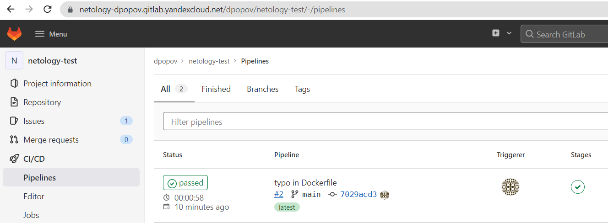

* Проверяем правильность загрузки образа в Image Registry

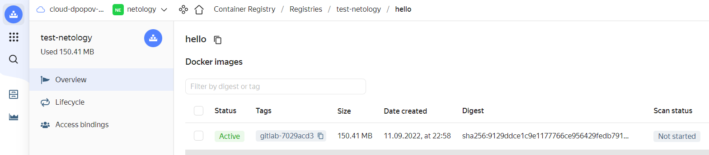

### Product Owner

Вашему проекту нужна бизнесовая доработка: необходимо поменять JSON ответа на вызов метода GET `/rest/api/get_info`, необходимо создать Issue в котором указать:
1. Какой метод необходимо исправить
2. Текст с `{ "message": "Already started" }` на `{ "message": "Running"}`
3. Issue поставить label: feature

* Создаем новый `issue`

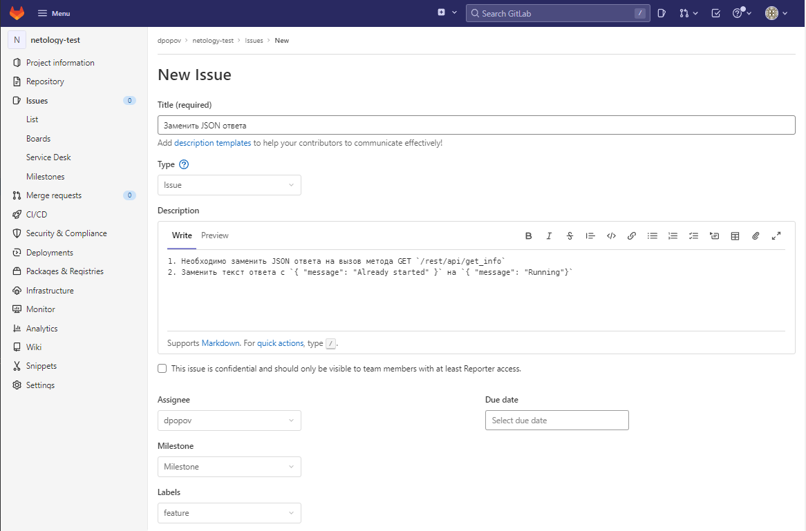

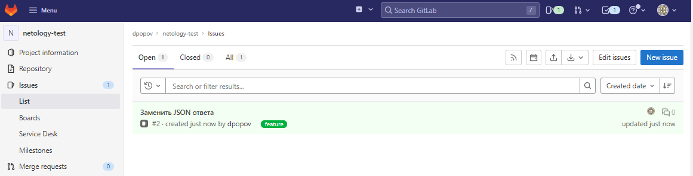

### Developer

Вам пришел новый Issue на доработку, вам необходимо:
1. Создать отдельную ветку, связанную с этим issue

* Создаем новую ветку

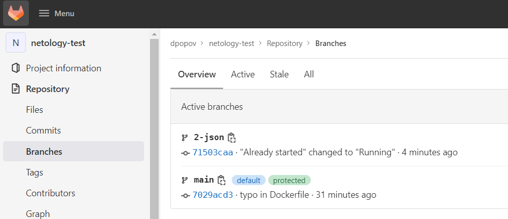

2. Внести изменения по тексту из задания

* Вносим изменения в `python_api.py`

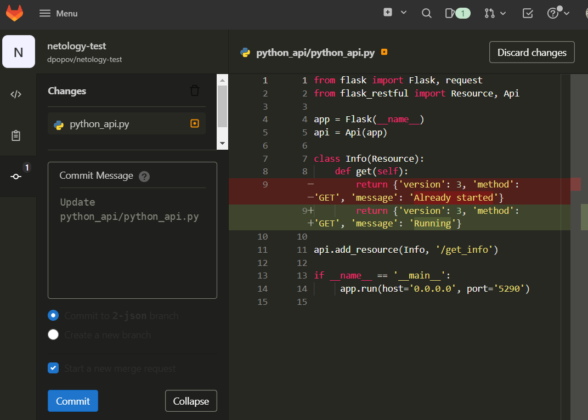


3. Подготовить Merge Requst, влить необходимые изменения в `master`, проверить, что сборка прошла успешно

* Создаем merge requiest

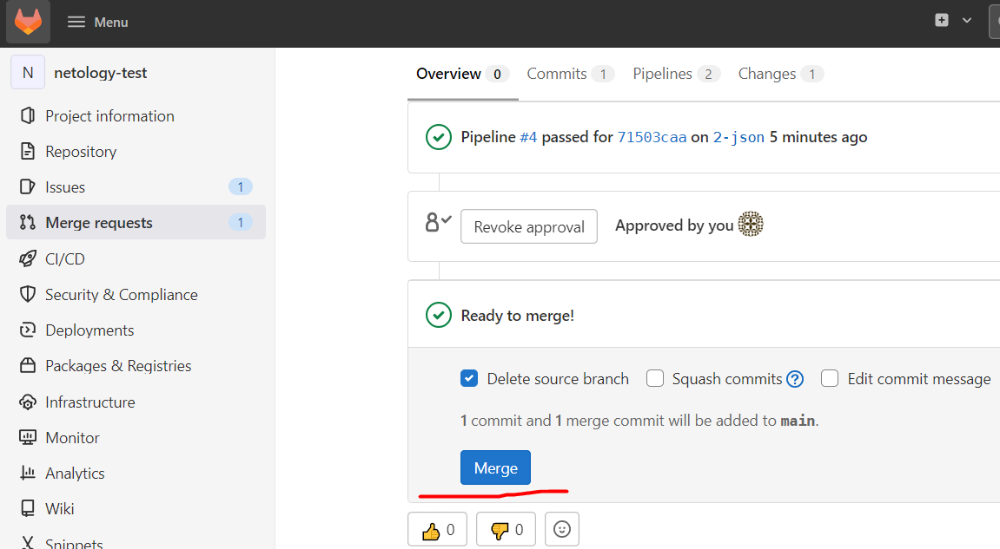

* Проверяем успешность сборки и образ в registry

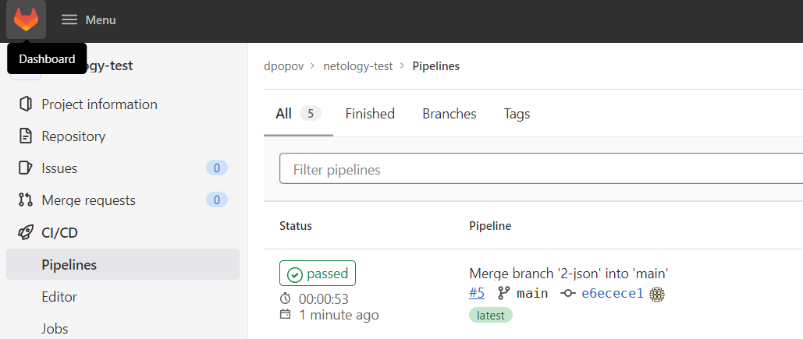

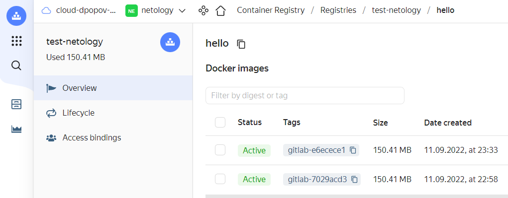


### Tester

Разработчики выполнили новый Issue, необходимо проверить валидность изменений:
1. Поднять докер-контейнер с образом `python-api:latest` и проверить возврат метода на корректность

* Проверяем успешность изменений

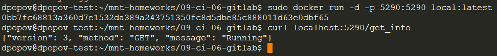

2. Закрыть Issue с комментарием об успешности прохождения, указав желаемый результат и фактически достигнутый

* Закрываем успешно выполненый issue

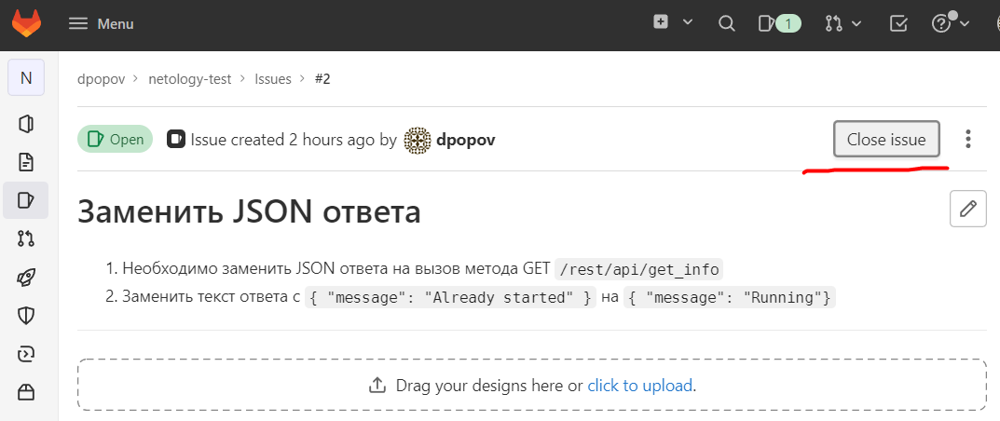

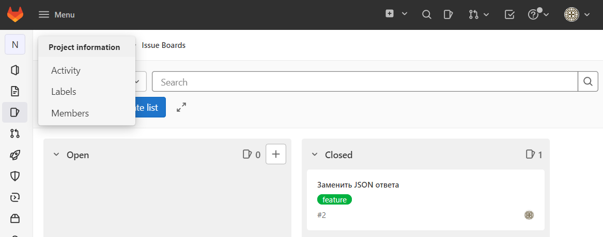

## Итог

После успешного прохождения всех ролей - отправьте ссылку на ваш проект в гитлаб, как решение домашнего задания

* [Ссылка]([https://netology-dpopov.gitlab.yandexcloud.net/users/sign_in](https://netology-dpopov.gitlab.yandexcloud.net/dpopov/netology-test.git)) на домашнюю работу по GitLab


* ### :bangbang: Не забудьте оставить GitLab рабочим после выполнения задания и погасить все ресурсы в Yandex.Cloud сразу после получения зачета по домашнему заданию.

## Необязательная часть

Автомазируйте работу тестировщика, пусть у вас будет отдельный конвейер, который автоматически поднимает контейнер и выполняет проверку, например, при помощи curl. На основе вывода - будет приниматься решение об успешности прохождения тестирования


